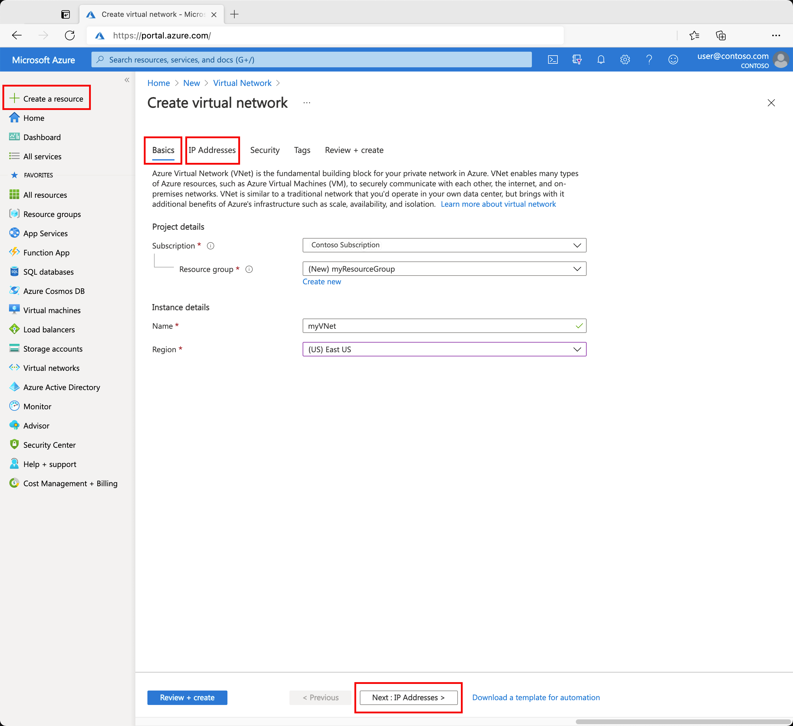

# <a name="create-a-virtual-network-using-the-azure-portal"></a>Azure 포털을 사용하여 가상 네트워크 만들기

가상 네트워크를 사용하면 VM(가상 머신)과 같은 Azure 리소스에서 서로 인터넷을 통해 개별적으로 통신할 수 있습니다. 이 문서에서는 가상 네트워크를 만드는 방법을 설명합니다. 가상 네트워크를 만든 후에 두 개의 VM을 가상 네트워크에 배포합니다. 그런 다음, 인터넷에서 하나의 VM에 연결하고 두 VM 간에 개별적으로 통신합니다.

Azure 구독이 아직 없는 경우 시작하기 전에 [무료 계정](https://azure.microsoft.com/free/?WT.mc_id=A261C142F)을 만듭니다.

## <a name="log-in-to-azure"></a>Azure에 로그인 

https://portal.azure.com에서 Azure Portal에 로그인합니다.

## <a name="create-a-virtual-network"></a>가상 네트워크 만들기

1. Azure Portal의 왼쪽 위에서 **+ 리소스 만들기**를 선택합니다.
2. **네트워킹**을 선택한 다음 **가상 네트워크**를 선택합니다.
3. 다음 정보를 입력하거나 선택하고, 나머지 설정에 대한 기본값을 그대로 적용한 다음, **만들기**를 선택합니다.

    |설정|값|
    |---|---|
    |Name|myVirtualNetwork|
    |구독| 사용 중인 구독을 선택합니다.|
    |리소스 그룹| **새로 만들기**를 선택하고 *myResourceGroup*을 입력합니다.|
    |위치| **미국 동부**를 선택합니다.|

    

## <a name="create-virtual-machines"></a>가상 머신 만들기

가상 네트워크에 두 개의 VM을 만듭니다.

### <a name="create-the-first-vm"></a>첫 번째 VM 만들기

1. Azure Portal의 왼쪽 위 모서리에 있는 **+ 리소스 만들기**를 선택합니다.
2. **Compute**를 선택한 후 **Windows Server 2016 Datacenter**를 선택합니다.
3. 다음 정보를 입력하거나 선택하고, 나머지 설정에 대한 기본값을 그대로 적용한 다음, **확인**을 선택합니다.

    |설정|값|
    |---|---|
    |Name|myVm1|
    |사용자 이름| 선택한 사용자 이름을 입력합니다.|
    |암호| 선택한 암호를 입력합니다. 암호는 12자 이상이어야 하며 [정의된 복잡성 요구 사항](../virtual-machines/windows/faq.md?toc=%2fazure%2fvirtual-network%2ftoc.json#what-are-the-password-requirements-when-creating-a-vm)을 충족해야 합니다.|
    |구독| 사용 중인 구독을 선택합니다.|
    |리소스 그룹| **기존 항목 사용**을 선택하고, **myResourceGroup**을 선택합니다.|
    |위치| **미국 동부**를 선택합니다.|

    

4. VM에 대한 크기를 선택한 다음, **선택**을 선택합니다.
5. **설정** 아래에서 모든 기본값을 그대로 적용한 다음, **확인**을 선택합니다.

    

6. **요약**의 **만들기** 아래에서 **만들기**를 선택하여 VM 배포를 시작합니다. VM을 배포하는 데 몇 분이 걸립니다. 

### <a name="create-the-second-vm"></a>두 번째 VM 만들기

1-6단계를 다시 수행하지만, 3단계에서 VM 이름을 *myVm2*로 지정합니다.

## <a name="connect-to-a-vm-from-the-internet"></a>인터넷에서 VM에 연결

1. *myVm1*이 만들어지면 연결합니다. Azure Portal 맨 위에 *myVm1*을 입력합니다. 검색 결과에서 표시되는 **myVm1**을 선택합니다. **연결** 단추를 선택합니다.

    

2. **연결** 단추를 선택하면 원격 데스크톱 프로토콜(.rdp) 파일이 만들어진 후 컴퓨터에 다운로드됩니다.  
3. 다운로드한 rdp 파일을 엽니다. 메시지가 표시되면 **연결**을 선택합니다. VM을 만들 때 지정한 사용자 이름과 암호를 입력합니다. **추가 선택 사항**, **다른 계정 사용**을 차례로 선택하여 VM을 만들 때 입력한 자격 증명을 지정해야 할 수도 있습니다. 
4. **확인**을 선택합니다.
5. 로그인 프로세스 중에 인증서 경고가 나타날 수 있습니다. 경고 메시지가 표시되면 **예** 또는 **계속**을 선택하여 연결을 계속합니다.

## <a name="communicate-privately-between-vms"></a>VM 간 개별적 통신

1. PowerShell에서 `ping myvm2`를 입력합니다. ping에서 ICMP(Internet Control Message Protocol)를 사용하고 ICMP는 기본적으로 Windows 방화벽을 통해 허용되지 않으므로 ping이 실패합니다.
2. 나중의 단계에서 *myVm2*를 통해 *myVm1*을 ping할 수 있게 하려면, PowerShell에서 다음과 같이 Windows 방화벽을 통한 ICMP 인바운드를 허용하는 명령을 입력합니다.

    ```powershell
    New-NetFirewallRule –DisplayName “Allow ICMPv4-In” –Protocol ICMPv4
    ```

3. *myVm1*에 대한 원격 데스크톱 연결을 닫습니다. 

4. [인터넷에서 VM에 연결](#connect-to-a-vm-from-the-internet)의 단계를 다시 수행하지만 *myVm2*에 연결합니다. 명령 프롬프트에서 `ping myvm1`을 입력합니다.

    이전 단계에서 *myVm1* VM의 Windows 방화벽을 통해 ICMP를 허용했으므로 *myVm1*에서 회신을 받습니다.

5. *myVm2*에 대한 원격 데스크톱 연결을 닫습니다.

## <a name="clean-up-resources"></a>리소스 정리

더 이상 필요하지 않은 경우 리소스 그룹 및 해당 그룹에 포함된 모든 리소스를 삭제합니다.

1. 포털 맨 위에 있는 **검색** 상자에 *myResourceGroup*을 입력합니다. 검색 결과에 **myResourceGroup**이 보이면 선택합니다.
2. **리소스 그룹 삭제**를 선택합니다.
3. **리소스 그룹 이름 입력:**에 *myResourceGroup*을 입력하고 **삭제**를 선택합니다.

## <a name="next-steps"></a>다음 단계

이 문서에서는 기본 가상 네트워크와 두 개의 VM을 만들었습니다. 인터넷에서 하나의 VM에 연결하고 VM 및 다른 VM 간에 개별적으로 통신했습니다. 가상 네트워크 설정에 대한 자세한 내용은 [가상 네트워크 관리](manage-virtual-network.md)를 참조하세요.

기본적으로 Azure는 가상 머신 간에 무제한 개별 통신을 허용하지만, 인터넷에서 Linux VM에 대한 인바운드 원격 데스크톱 연결만 허용합니다. VM 간에 다양한 유형의 네트워크 통신을 허용하거나 제한하는 방법을 알아보려면 다음 자습서로 계속 진행하세요.

> [!div class="nextstepaction"]
> [네트워크 트래픽 필터링](virtual-networks-create-nsg-arm-pportal.md)