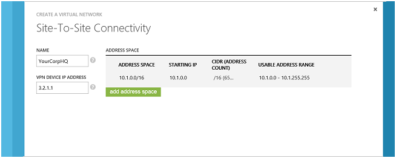
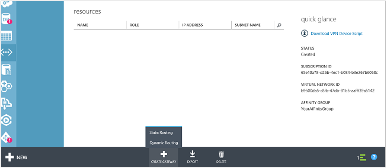

<properties 
	pageTitle="자습서: 사이트 간 연결용 프레미스 간 가상 네트워크 만들기" 
	description="이 자습서에서는 프레미스 간 연결을 지원하는 Azure 가상 네트워크를 만드는 방법에 대해 알아봅니다." 
	services="virtual-network" 
	documentationCenter="" 
	authors="cherylmc" 
	manager="adinah" 
	editor="tysonn"/>

<tags 
	ms.service="virtual-network" 
	ms.workload="infrastructure-services" 
	ms.tgt_pltfrm="na" 
	ms.devlang="na" 
	ms.topic="article" 
	ms.date="04/28/2015" 
	ms.author="cherylmc"/>

# 자습서: 사이트 간 연결용 프레미스 간 가상 네트워크 만들기

이 자습서에서는 사이트 간 연결이 있는 프레미스 간 가상 네트워크 예제를 만드는 단계를 안내합니다.

클라우드 전용 가상 네트워크를 만들려는 경우, [자습서: Azure에서 클라우드 전용 가상 네트워크 만들기](create-virtual-network.md)를 참조하세요. 인증서 및 VPN 클라이언트를 사용하여 지점 및 사이트 간 VPN을 만들려는 경우 [관리 포털 마법사를 사용하여 지점 및 사이트 간 VPN 구성](http://go.microsoft.com/fwlink/p/?LinkId=296653)을 참조하십시오.

이 자습서에서는 이전에 Azure를 사용한 경험이 없다고 가정합니다. 이 자습서는 프레미스 간 가상 네트워크 예제를 만드는 데 필요한 단계에 익숙해지도록 돕기 위한 것입니다. 가상 네트워크에 대한 디자인 시나리오 및 고급 정보를 원하는 경우에는 [Azure 가상 네트워크 개요](http://msdn.microsoft.com/library/windowsazure/jj156007.aspx)를 참조하십시오.

이 자습서를 완료하고 나면 프레미스 간 가상 네트워크 예제가 준비됩니다. 다음 그림에서는 이 자습서에서 예제 설정을 기반으로 한 세부 정보를 보여 줍니다.

이 그림의 복사본과 고유한 프레미스 간 가상 네트워크를 설명하는 데 사용할 수 있는 그림을 보려면 [자습서 항목에서 프레미스 간 가상 네트워크 예제 그림](http://gallery.technet.microsoft.com/Example-cross-premises-e5ecb8bb)을 참조하세요.

이 자습서에서 사용된 구성 설정 예제는 귀사의 네트워크에 맞게 사용자 지정되어 있지 않습니다. 이 항목에 설명된 구성 설정 예제를 사용하여 가상 네트워크 및 사이트 간 연결을 구성하면 제대로 작동하지 않습니다. 제대로 작동하는 프레미스 간 가상 네트워크를 구성하려면 IT 부서 및 네트워크 관리자와 협력하여 정확한 설정을 찾아야 합니다. 자세한 내용은 이 항목의 **필수 조건** 섹션을 참조하십시오.

가상 컴퓨터 추가 및 Azure 가상 네트워크로 온-프레미스 Active Directory 확장에 대한 자세한 내용은 다음 문서를 참조하세요.

-  [사용자 지정 방식으로 가상 컴퓨터를 만드는 방법](http://go.microsoft.com/fwlink/p/?LinkID=294356)

-  [Azure 가상 네트워크에서 복제 Active Directory 도메인 컨트롤러 설치](http://go.microsoft.com/fwlink/p/?LinkId=299877)

Azure 가상 컴퓨터에 AD DS를 배포하는 방법에 대한 지침은 [Azure 가상 컴퓨터에서의 Windows Server Active Directory 배포 지침](http://msdn.microsoft.com/library/windowsazure/jj156090.aspx)을 참조하십시오.

추가 가상 네트워크 구성 절차 및 설정은 [Azure 가상 네트워크 구성 작업](http://go.microsoft.com/fwlink/p/?LinkId=296652)을 참조하십시오.

##  목표

이 자습서에서는 다음에 대해 알아봅니다.

-  Azure 서비스를 추가할 수 있는 프레미스 간 Azure 가상 네트워크 예제를 설정하는 방법

-  조직 네트워크와 통신하도록 가상 네트워크를 구성하는 방법

##  필수 조건

-  진행 중인 유효한 Azure 구독이 하나 이상 있는 Microsoft 계정. 아직 Azure 구독이 없는 경우에는 [Azure 평가판 사용](http://azure.microsoft.com/pricing/free-trial/)에서 무료로 가입할 수 있습니다. MSDN 구독이 있는 경우에는 [Microsoft Azure 특별 가격: MSDN, MPN 및 Bizspark 이점](http://azure.microsoft.com/pricing/member-offers/msdn-benefits-details/)을 참조하세요.

이 자습서를 사용하여 귀사에 맞게 사용자 지정되고 실제로 작동하는 프레미스 간 가상 네트워크를 구성하려면 다음이 필요합니다.

-  가상 네트워크 및 해당 서브넷을 위한 전용 IPv4 주소 공간(CIDR 표기법)

-  온-프레미스 DNS 서버의 이름과 IP 주소

-  공개 IPv4 주소를 사용하는 VPN 장치. 마법사를 완료하려면 IP 주소가 필요합니다. VPN 장치는 NAT(Network Address Translator) 뒤에 배치될 수 없으며 최소 장치 표준을 충족해야 합니다. 자세한 내용은 [가상 네트워크의 VPN 장치 정보](http://go.microsoft.com/fwlink/p/?LinkID=248098)를 참조하십시오.

	참고: VPN 솔루션의 일부로 Windows Server에서 RRAS(라우팅 및 원격 액세스 서비스)를 사용할 수 있습니다. 그러나 이 자습서에서는 RRAS 구성 단계를 안내하지 않습니다. RRAS 구성 정보에 대해서는 [라우팅 및 원격 액세스 서비스 템플릿](http://msdn.microsoft.com/library/windowsazure/dn133801.aspx)을 참조하십시오.

-  IPsec 터널 모드 연결을 위한 라우터 구성에 대한 경험 또는 이 단계에 도움이 될 수 있는 다른 사람

-  온-프레미스 네트워크(로컬 네트워크라고도 함)의 연결 가능한 위치를 요약하는 주소 공간 집합(CIDR 표기법)

## 대략적인 단계

1.	[가상 네트워크 만들기](#CreateVN)

2.	[게이트웨이 시작 및 네트워크 관리자에 대한 정보 수집](#StartGateway)

3.  [VPN 장치 구성](#ConfigVPN)

##  <a name="CreateVN">가상 네트워크 만들기</a>

회사 네트워크에 연결되는 가상 네트워크 예제를 만들려면

1.	[Azure 관리 포털](http://manage.windowsazure.com/)에 로그인합니다.

2.	화면의 왼쪽 아래에서 **새로 만들기**를 클릭합니다. 탐색 창에서 **네트워크**를 클릭한 다음 **가상 네트워크**를 클릭합니다. **사용자 지정 만들기**를 클릭하여 구성 마법사를 시작합니다.

	

3.	**가상 네트워크 세부 정보** 페이지에서 다음 정보를 입력한 후 오른쪽 아래에서 다음 화살표를 클릭합니다. 정보 페이지의 설정에 대한 자세한 내용은 **관리 포털의 가상 네트워크 구성 정보**의 [가상 네트워크 정보](http://go.microsoft.com/fwlink/p/?LinkID=248092) 섹션을 참조하십시오.

	-  **이름:** 가상 네트워크 이름을 지정합니다. 이 자습서에 있는 예제의 경우 **YourVirtualNetwork**를 입력합니다.

	-  **위치:** 드롭다운 목록에서 원하는 지역을 선택합니다. 지정한 지역에 있는 Azure 데이터 센터에 가상 네트워크가 만들어집니다.

	
4.	**DNS 서버 및 VPN 연결** 페이지에서 다음 정보를 입력한 후 화면 아래의 오른쪽에 있는 정방향 화살표를 클릭합니다.

> [AZURE.NOTE]이 페이지에서 **지점 및 사이트 간**과 **사이트 간** 구성을 동시에 선택할 수는 없습니다. 이 자습서에서는 **사이트 간**만 구성하도록 선택합니다. 이 페이지의 설정에 대한 자세한 내용은 **관리 포털의 가상 네트워크 구성 정보**의 [DNS 서버 및 VPN 연결](http://go.microsoft.com/fwlink/p/?LinkID=248092) 페이지를 참조하십시오.

	-  **DNS SERVERS:** Enter the DNS server name and IP address that you want to use for name resolution. Typically this would be a DNS server that you use for on-premises name resolution. This setting does not create a DNS server. For the example in this tutorial, type **YourDNS** for the name and **10.1.0.4** for the IP address.
	-  **Configure Point-To-Site VPN:** Leave this field blank. 
	-  **Configure Site-To-Site VPN:** Select checkbox.
	-  **LOCAL NETWORK:** Select **Specify a New Local Network** from the drop-down list.
 
	

5.	**사이트 간 연결** 페이지에서 아래 정보를 입력한 후 페이지 아래의 오른쪽에 있는 확인 표시를 클릭합니다. 이 페이지의 설정에 대한 자세한 내용은 **관리 포털의 가상 네트워크 구성 정보**의 [사이트 간 연결](http://go.microsoft.com/fwlink/p/?LinkID=248092) 페이지 섹션을 참조하십시오. 

	-  **이름:** 이 자습서에 있는 예제의 경우 **YourCorpHQ**를 입력합니다.

	-  **VPN 장치 IP 주소:** 이 자습서의 예제에서는 **3.2.1.1**을 입력합니다. 그렇지 않으면 VPN 장치의 공개 IP 주소를 입력합니다. 이 정보가 없는 경우 마법사의 다음 단계를 진행하기 전에 이 정보를 가져와야 합니다. VPN 장치는 NAT 뒤에 배치할 수 없습니다. VPN 장치에 대한 자세한 내용은 [가상 네트워크의 VPN 장치 정보](http://msdn.microsoft.com/library/windowsazure/jj156075.aspx)를 참조하세요.

	-  **주소 공간:** 이 자습서에 있는 예제의 경우 **10.1.0.0/16**을 입력합니다.
	-  **주소 공간 추가:** 이 자습서에서는 추가 주소 공간이 필요하지 않습니다.

	

6.  **가상 네트워크 주소 공간** 페이지에서 아래 정보를 입력한 후 페이지 아래의 오른쪽에 있는 확인 표시를 클릭하여 네트워크를 구성합니다.

	주소 공간은 10.0.0.0/8, 172.16.0.0/12 또는 192.168.0.0/16 주소 공간(RFC 1918에서 지정하는 대로)에서 CIDR 표기법으로 지정된 개인 주소 범위여야 합니다. 이 페이지의 설정에 대한 자세한 내용은 **관리 포털의 가상 네트워크 구성 정보**의 [가상 네트워크 주소 공간](http://go.microsoft.com/fwlink/?LinkID=248092) 페이지를 참조하십시오.

	-  **주소 공간:** 이 자습서에 있는 예제의 경우 화면 위의 오른쪽 모서리에서  **CIDR**을 클릭한 후 다음을 입력합니다.
		-  **시작 IP:** 10.4.0.0
		-  **CIDR:** /16
	-  **서브넷 추가:** 이 자습서에 있는 예제의 경우 다음을 입력합니다.
		-  **Subnet-1**을 시작 IP **10.4.2.0/24**인 **FrontEndSubnet**으로 바꿉니다.
		-  시작 IP가 **10.4.3.0/24**인 **BackEndSubnet**이라는 서브넷을 추가합니다.
		-  시작 IP가 **10.4.4.0/24**인 **ADDNSSubnet**이라는 서브넷을 추가합니다.
		-  시작 IP가 **10.4.1.0/24**인 게이트웨이 서브넷을 추가합니다.
	-  이 자습서에 있는 예제의 경우 이제 3개의 서브넷과 게이트웨이 서브넷이 만들어졌는지 확인한 후 페이지 아래의 오른쪽에 있는 확인 표시를 클릭하여 가상 네트워크를 만듭니다.

	

7.	확인 표시를 클릭하면 가상 네트워크가 만들어지기 시작합니다. 가상 네트워크가 만들어지면 관리 포털의 네트워크 페이지에 있는 **상태** 아래에 **Created**가 나열됩니다.

	

##  <a name="StartGateway">게이트웨이 시작</a>

Azure 가상 네트워크를 만든 후 사이트 간 VPN을 만들려면 다음 절차에 따라 가상 네트워크 게이트웨이를 구성합니다. 이 절차에서는 최소 요구 사항을 충족하는 VPN 장치가 있어야 합니다. VPN 장치 및 장치 구성에 대한 자세한 내용은 [가상 네트워크의 VPN 장치 정보](http://go.microsoft.com/fwlink/p/?LinkID=248098)를 참조하십시오.

**게이트웨이를 시작하려면**

1.	가상 네트워크가 만들어지면 **네트워크** 페이지에 가상 네트워크의 상태가 **Created**로 표시됩니다.

	**이름** 열에서 **YourVirtualNetwork**(이 자습서에서 만든 예제의 경우)를 클릭하여 대시보드를 엽니다.
 
	

2.	페이지 위쪽에서 **대시보드**를 클릭합니다. 대시보드 페이지의 아래에 있는 **CREATE GATEWAY**를 클릭합니다. 만들려는 게이트웨이 유형에 대해 **Dynamic Routing** 또는 **Static Routing**을 선택합니다.

	사이트 간 연결뿐 아니라 지점 및 사이트 간 연결에도 이 가상 네트워크를 사용하려는 경우 **Dynamic Routing**을 게이트웨이 유형으로 선택해야 합니다. 게이트웨이를 만들기 전에 VPN 장치에서 만들려는 게이트웨이 유형을 지원하는지 확인합니다. [가상 네트워크의 VPN 장치 정보](http://go.microsoft.com/fwlink/p/?LinkID=248098)를 참조하십시오. 시스템에서 게이트웨이 만들 것인지 확인하는 메시지를 표시하면 **예**를 클릭합니다.

	

3.	게이트웨이 만들기가 시작되면 게이트웨이가 시작되었음을 알려 주는 메시지가 표시됩니다.

	게이트웨이를 만드는 데에는 최대 15분이 걸릴 수 있습니다.

4.	게이트웨이가 만들어진 후 VPN 장치를 구성하는 데 사용할 다음 정보를 수집해야 합니다.

	-  게이트웨이 IP 주소
	-  공유 키
	-  VPN 장치 구성 스크립트 템플릿

	다음 단계에서 이 프로세스를 안내합니다.

5.	게이트웨이 IP 주소 찾기: 게이트웨이 IP 주소는 가상 네트워크 **대시보드** 페이지에 나와 있습니다. 다음은 예제입니다.

	

6.	공유 키 수집 - 공유 키는 가상 네트워크 **대시보드** 페이지에 나와 있습니다. 화면 아래에 있는 **Manage Key**를 클릭한 후 대화 상자에 표시되는 키를 복사합니다. 귀사의 VPN 장치에서 IPsec 터널을 구성하려면 이 키가 필요합니다.

	

7.	VPN 장치 구성 스크립트 템플릿을 다운로드하려면, 대시보드에서 **VPN 장치 스크립트 다운로드**를 클릭합니다.

8.	**Download a VPN Device Configuration Script** 대화 상자에서 회사의 VPN 장치에 대한 공급업체, 플랫폼 및 운영 체제를 선택합니다. 확인 표시 단추를 클릭하고 파일을 저장합니다.

	

드롭다운 목록에 VPN 장치가 표시되지 않는 경우 MSDN 라이브러리의 [가상 네트워크의 VPN 장치 정보](http://go.microsoft.com/fwlink/p/?LinkID=248098)에서 추가 스크립트 템플릿에 대한 내용을 참조하십시오.

##  <a name="ConfigVPN">VPN 장치 구성(네트워크 관리자)</a>

각 VPN 장치가 서로 다르므로 대략적인 절차만 다룹니다. 이 절차는 네트워크 관리자만 수행해야 합니다.

관리 포털 또는 [가상 네트워크의 VPN 장치 정보](http://go.microsoft.com/fwlink/p/?LinkId=248098)에서 VPN 구성 스크립트를 가져올 수 있습니다. 이 웹 문서에서는 사용할 라우팅 구성과 호환되는 장치 및 라우팅 유형에 대해서도 설명합니다.

가상 네트워크 게이트웨이 구성에 대한 추가 정보는 [관리 포털의 가상 네트워크 게이트웨이 구성](http://go.microsoft.com/fwlink/p/?LinkId=299878)을 참조하고 VPN 장치 설명서를 참조하십시오.

이 절차에서는 다음을 가정합니다.

-  VPN 장치를 구성하는 사람은 선택된 장치 구성에 능숙해야 합니다. 가상 네트워크와 호환되는 장치 수 및 각 장치 제품군과 관련된 구성으로 인해 다음 단계에서는 세부적인 수준의 장치 구성을 안내하지 않습니다. 따라서 장치를 구성하는 사람이 장치 및 구성 설정에 익숙해야 합니다. 

-  사용할 장치가 가상 네트워크와 호환됩니다. 장치 호환성에 대해서는 [여기](http://go.microsoft.com/fwlink/p/?LinkID=248098)를 참조하십시오.

**VPN 장치를 구성하려면**

1.	VPN 구성 스크립트를 수정합니다. 다음을 구성합니다.

	a. 보안 정책

	b. 들어오는 터널

	c. 나가는 터널

2.	수정된 VPN 구성 스크립트를 실행하여 VPN 장치를 구성합니다.

3.	다음 명령 중 하나를 실행하여 연결을 테스트합니다.

	<table border="1">
<tr>
<th>-</th>
<th>Cisco ASA</th>
<th>Cisco ISR/ASR</th>
<th>Juniper SSG/ISG</th>
<th>Juniper SRX/J</th>
</tr>

<tr>
<td><b>Check main mode SAs</b></td>
<td>show crypto isakmp sa</td>
<td>show crypto isakmp sa</td>
<td>get ike cookie</td>
<td>show security ike security-association</td>
</tr>

<tr>
<td><b>Check quick mode SAs</b></td>
<td>show crypto ipsec sa</td>
<td>show crypto ipsec sa</td>
<td>get sa</td>
<td>show security ipsec security-association</td>
</tr>
</table>

##  다음 단계
온-프레미스 Active Directory를 방금 만든 가상 네트워크로 확장하려면 다음 자습서를 진행하세요.

-  [사용자 지정 방식으로 가상 컴퓨터를 만드는 방법](http://go.microsoft.com/fwlink/p/?LinkID=294356)

-  [Azure 가상 네트워크에서 복제 Active Directory 도메인 컨트롤러 설치](http://go.microsoft.com/fwlink/p/?LinkId=299877)

구성을 백업하거나 템플릿으로 사용하기 위해 가상 네트워크 설정을 네트워크 구성 파일로 내보내려는 경우 [가상 네트워크 설정을 네트워크 구성 파일로 내보내기](http://go.microsoft.com/fwlink/p/?LinkID=299880)를 참조하십시오.

## 참고 항목

-  [Azure 가상 네트워크 기술 개요](http://msdn.microsoft.com/library/windowsazure/jj156007.aspx)

-  [가상 네트워크 FAQ](http://msdn.microsoft.com/library/windowsazure/dn133803.aspx)

-  [네트워크 구성 파일을 사용하여 가상 네트워크 구성](virtual-networks-using-network-configuration-file.md)

-  [가상 네트워크에 가상 컴퓨터 추가](virtual-machines-create-custom.md)

-  [가상 네트워크의 VPN 장치 정보](http://msdn.microsoft.com/library/windowsazure/jj15] 75.aspx)

-  [VM 및 역할 인스턴스에 대한 이름 확인](http://go.microsoft.com/fwlink/p/?LinkId=248097)
-  [테스트용 하이브리드 클라우드 환경 설정](virtual-networks-setup-hybrid-cloud-environment-testing.md)

<!---HONumber=58-->