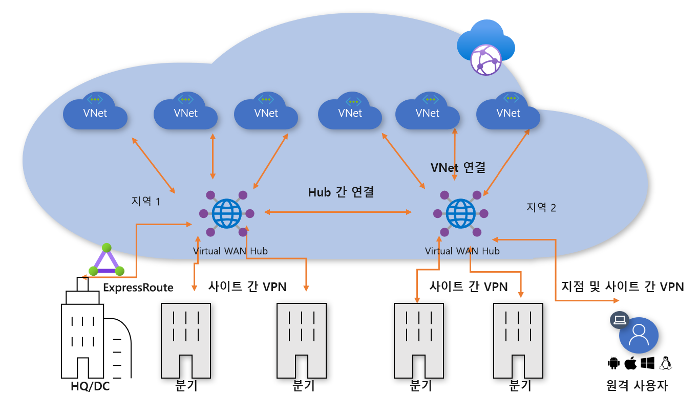
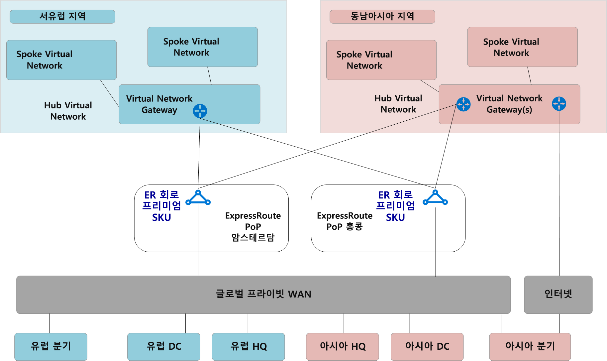
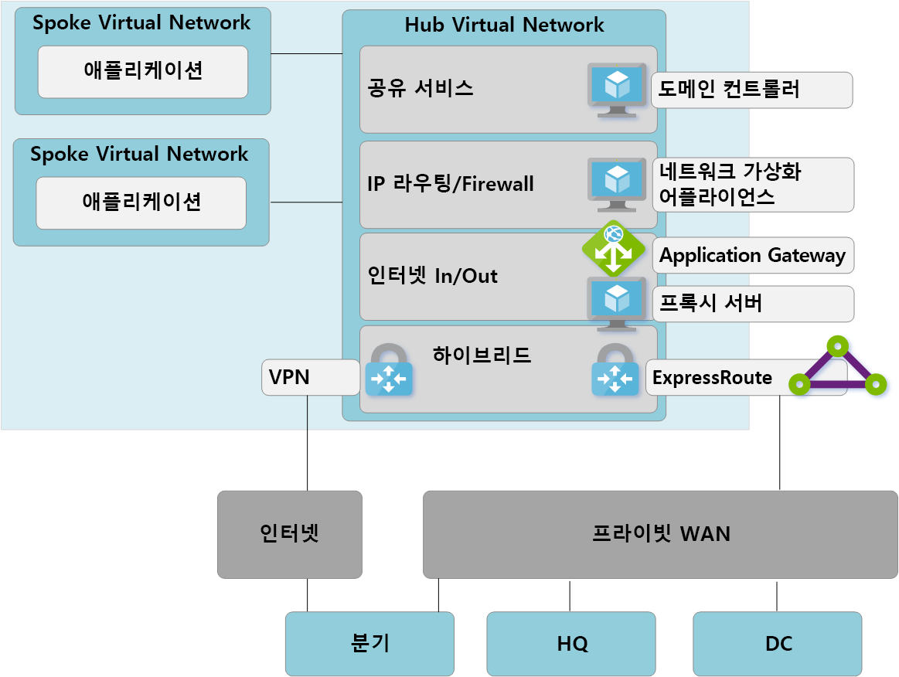
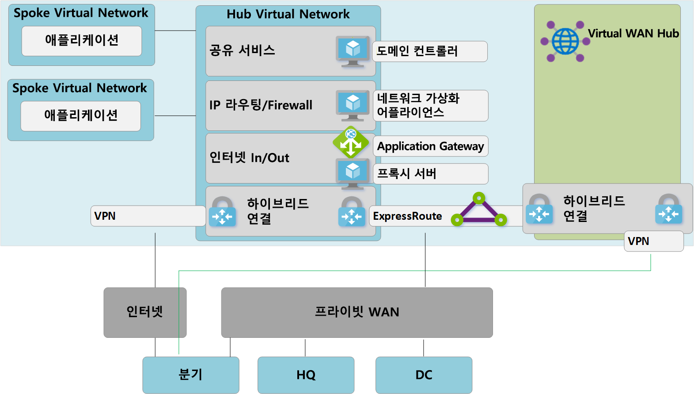
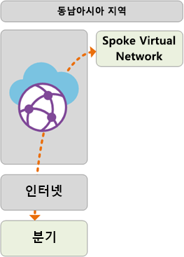
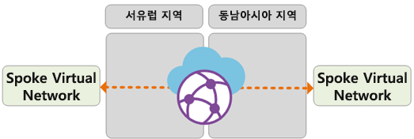
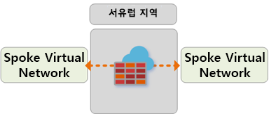

# Azure Virtual WAN으로 마이그레이션

Azure 가상 WAN을 사용 하면 회사에서 글로벌 연결을 단순화 하 여 Microsoft 글로벌 네트워크 규모의 이점을 누릴 수 있습니다. 이 문서에서는 기존 고객이 관리 하는 허브 및 스포크 토폴로지에서 Microsoft에서 관리 하는 가상 WAN 허브를 활용 하는 설계로 마이그레이션하려는 회사에 대 한 기술 세부 정보를 제공 합니다.

Azure 가상 WAN이 클라우드 중심 최신 엔터프라이즈 글로벌 네트워크를 채택 하는 데 사용 하는 이점에 대 한 자세한 내용은 [글로벌 전송 네트워크 아키텍처 및 가상 WAN](virtual-wan-global-transit-network-architecture.md)을 참조 하세요.

 **그림: AZURE 가상 WAN**

Azure 허브 및 스포크 연결 모델은 수천 명의 고객이 Azure 네트워킹의 기본 전이적 라우팅 동작을 활용 하 여 간단 하 고 확장 가능한 클라우드 네트워크를 빌드하기 위해 채택 했습니다. Azure 가상 WAN은 이러한 개념을 기반으로 하며, 온-프레미스 위치와 Azure 사이에서 뿐만 아니라 고객이 Microsoft 네트워크의 규모를 활용 하 여 기존 글로벌 네트워크를 확장할 수 있도록 하는 새로운 기능을 소개 합니다.

이 문서에서는 기존 하이브리드 환경을 가상 WAN으로 마이그레이션하는 방법을 보여 줍니다.

## 시나리오

Contoso는 유럽 및 아시아에서 사무실이 있는 글로벌 재무 조직입니다. 이는 기존 응용 프로그램을 온-프레미스 데이터 센터에서 Azure로 이동 하 고 하이브리드 연결용 지역 고객 관리 허브 가상 네트워크를 비롯 한 수동 허브 및 스포크 아키텍처를 기반으로 하는 기반 디자인을 구축 하는 계획입니다. 클라우드 기반 기술로 전환 하는 과정의 일환으로, 네트워크 팀은 해당 연결이 비즈니스에 맞게 최적화 되어 있는지 확인 하는 것을 담당 하 고 있습니다.

다음 그림은 여러 Azure 지역에 대 한 연결을 포함 하 여 기존의 글로벌 네트워크에 대 한 개략적인 보기를 보여 줍니다.

 **그림: contoso 기존 네트워크 토폴로지**

기존 네트워크 토폴로지에서 이해할 수 있는 사항은 다음과 같습니다.

- 허브 앤 스포크 토폴로지는 ExpressRoute Premium 회로를 포함하여 여러 지역에서 공용 개인 WAN으로 다시 연결하는 데 사용됩니다.

- 이러한 사이트 중 일부에는 Microsoft Cloud 내에서 호스팅되는 애플리케이션에 도달하기 위해 Azure에 직접 연결되는 VPN 터널도 있습니다.

## 요구 사항

네트워킹 팀은 클라우드로의 Contoso 마이그레이션을 지원할 수 있는 글로벌 네트워크 모델을 제공했으며, 비용, 규모 및 성능 영역에서 최적화해야 합니다. 요약하면, 다음 요구 사항이 충족되어야 합니다.

- 클라우드 호스팅 애플리케이션에 최적화된 경로를 HQ(본사)와 지점 모두에 제공합니다.
- 다음 연결 경로를 유지 하면서 VPN 종료에 대 한 기존 온-프레미스 데이터 센터 (DC)의 의존도를 제거 합니다.
  - **VNet에**연결: VPN 연결 사무소는 로컬 Azure 지역에서 클라우드로 마이그레이션된 응용 프로그램에 액세스할 수 있어야 합니다.
  - **허브에서 VNet**으로의 연결: VPN 연결 된 사무실은 원격 Azure 지역의 클라우드로 마이그레이션된 응용 프로그램에 액세스할 수 있어야 합니다.
  - **분기 분기: 지역**VPN 연결 된 사무실은 서로 통신할 수 있어야 하 고, 연결 된 본사/DC 사이트와 통신할 수 있어야 합니다.
  - **허브**간 분기 간: 전 세계에 분리 된 VPN 연결 사무실은 서로 통신할 수 있어야 하 고, 모든 express 경로 연결 된 사령부/DC 사이트와 통신할 수 있어야 합니다.
  - **인터넷 지점**: 연결 된 사이트는 인터넷과 통신할 수 있어야 합니다. 이 트래픽을 필터링 하 고 기록 해야 합니다.
  - **Vnet 간**: 동일한 지역의 스포크 가상 네트워크는 서로 통신할 수 있어야 합니다.
  - **Vnet**간-허브-vnet 간: 다른 지역의 스포크 가상 네트워크는 서로 통신할 수 있어야 합니다.
- 회사 네트워크에 있지 않은 동안 회사 리소스에 액세스할 수 있는 Contoso 로밍 사용자 (랩톱 및 전화)의 기능을 제공 합니다.

## Azure 가상 WAN 아키텍처

다음 그림은 이전 섹션에서 자세히 설명 하는 요구 사항을 충족 하기 위해 Azure 가상 WAN을 사용 하는 업데이트 된 대상 토폴로지의 상위 수준 보기를 보여 줍니다.

 **그림: AZURE 가상 wan 아키텍처**

요약:

- 유럽의 HQ는 ExpressRoute 연결 상태를 유지하고, 유럽 온-프레미스 DC는 Azure로 완전히 마이그레이션되어 현재 서비스 해제되었습니다.
- 아시아 DC 및 HQ는 프라이빗 WAN 연결 상태를 유지합니다. 이제 Azure 가상 WAN을 사용 하 여 로컬 캐리어 네트워크를 보강 하 고 글로벌 연결을 제공 합니다.
- Azure 가상 WAN 허브는 유럽 서부 및 남부 동아시아 Azure 지역에 배포 되어 Express 경로 및 VPN 연결 장치에 대 한 연결 허브를 제공 합니다.
- 허브는 글로벌 메시 네트워크에 대한 OpenVPN 연결을 사용하여 여러 클라이언트 유형에서 로밍 사용자에게 VPN 종료도 제공하므로, Azure로 마이그레이션된 애플리케이션뿐만 아니라 온-프레미스에 남아 있는 모든 리소스에도 액세스할 수 있습니다.
- Azure Virtual WAN에서 가상 네트워크 내의 리소스에 대한 인터넷 연결을 제공합니다.

Azure Virtual WAN에서 원격 사이트에 대한 인터넷 연결도 제공합니다. Microsoft 365와 같은 SaaS 서비스에 최적화 된 액세스를 위해 파트너 통합을 통해 지원 되는 로컬 인터넷 분리

## Virtual WAN으로 마이그레이션

이 섹션에서는 Azure 가상 WAN으로 마이그레이션하는 다양 한 단계를 보여 줍니다.

### 1 단계: 고객 관리 허브 및 스포크 단일 지역

다음 그림은 Azure 가상 WAN을 출시 하기 전에 Contoso의 단일 지역 토폴로지를 보여 줍니다.

 **그림 1: 단일 지역 수동 허브 및 스포크**

허브 및 스포크 방식으로 유지 하기 위해 고객 관리 허브 가상 네트워크에는 다음과 같은 여러 가지 함수 블록이 포함 되어 있습니다.

- 공유 서비스 (여러 스포크에 필요한 모든 일반 함수). 예: Contoso는 IaaS (Infrastructure as a service) 가상 머신에서 Windows Server 도메인 컨트롤러를 사용 합니다.
- IP/라우팅 방화벽 서비스는 타사 네트워크 가상 어플라이언스에서 제공하며, 스포크-스포크 계층 3 IP 라우팅이 가능합니다.
- 인터넷 리소스에 대해 필터링된 아웃바운드 액세스를 위해 가상 머신에서 실행되는 인바운드 HTTPS 요청 및 타사 프록시 서비스에 대한 Azure Application Gateway를 포함한 인터넷 수신/송신 서비스입니다.
- 온-프레미스 네트워크에 연결 하기 위한 Express 경로 및 VPN 가상 네트워크 게이트웨이.

### 2 단계: 가상 WAN 허브 배포

각 지역에 가상 WAN 허브를 배포 합니다. 다음 문서에 설명 된 대로 VPN Gateway 및 Express 경로 게이트웨이를 사용 하 여 가상 WAN 허브를 설정 합니다.

- [자습서: Azure Virtual WAN을 사용하여 사이트 간 연결 만들기](virtual-wan-site-to-site-portal.md)
- [자습서: Azure 가상 WAN을 사용 하 여 Express 경로 연결 만들기](virtual-wan-expressroute-portal.md)

> [!NOTE]
> Azure 가상 WAN은 표준 SKU를 사용 하 여이 문서에 표시 된 트래픽 경로 중 일부를 사용 하도록 설정 해야 합니다.

 **그림 2: 고객이 관리 하는 허브 및 스포크를 가상 wan으로 마이그레이션**

### 3 단계: 원격 사이트 (Express 경로 및 VPN)를 가상 WAN에 연결

가상 WAN 허브를 기존 Express 경로 회로에 연결 하 고 인터넷을 통해 사이트 간 Vpn을 원격 분기로 설정 합니다.

> [!NOTE]
> Virtual WAN 허브에 연결하려면 ExpressRoute 회로를 프리미엄 SKU 유형으로 업그레이드해야 합니다.

 **그림 3: 고객이 관리 하는 허브 및 스포크를 가상 wan으로 마이그레이션**

이 시점에서 온-프레미스 네트워크 장비는 가상 WAN 관리 허브 VNet에 할당 된 IP 주소 공간을 반영 하는 경로를 수신 하기 시작 합니다. 이 단계에서 원격 VPN 연결 분기에는 스포크 가상 네트워크의 기존 애플리케이션에 대한 두 가지 경로가 표시됩니다. 이러한 장치는 전환 단계에서 대칭 라우팅을 보장 하기 위해 고객 관리 허브에 대 한 터널을 계속 사용 하도록 구성 해야 합니다.

### 4 단계: 가상 WAN을 통해 하이브리드 연결 테스트

프로덕션 연결에 관리 되는 가상 WAN 허브를 사용 하기 전에 테스트 스포크 가상 네트워크 및 가상 WAN VNet 연결을 설정 하는 것이 좋습니다. 다음 단계를 계속하기 전에 ExpressRoute 및 사이트 간 VPN을 통해 이 테스트 환경에 대한 연결이 작동하는지 확인합니다.

 **그림 4: 고객이 관리 하는 허브 및 스포크를 가상 wan으로 마이그레이션**

### 5 단계: 가상 WAN 허브로의 연결 전환

 **그림 5: 고객이 관리 하는 허브 및 스포크에서 가상 wan으로의 마이그레이션**

**입니다.** 스포크 가상 네트워크에서 이전의 고객이 관리 하는 허브로 기존 피어 링 연결을 삭제 합니다. a-c 단계가 완료될 때까지는 스포크 가상 네트워크의 애플리케이션에 액세스할 수 없습니다.

**2**. VNet 연결을 통해 가상 WAN 허브에 스포크 가상 네트워크를 연결 합니다.

**c**3. 스포크-스포크 통신을 위해 이전에 스포크 가상 네트워크 내에서 사용된 모든 UDR(사용자 정의 경로)을 제거합니다. 이 경로는 이제 Virtual WAN 허브 내에서 사용할 수 있는 동적 라우팅을 통해 사용하도록 설정됩니다.

**4**. 고객 관리 허브의 기존 Express 경로 및 VPN 게이트웨이는 이제 다음 단계 (e)를 허용 하도록 서비스 해제 됩니다.

**e**. 새 VNet 연결을 통해 이전의 고객이 관리 하는 허브 (허브 가상 네트워크)를 가상 WAN 허브에 연결 합니다.

### 6 단계: 이전 허브가 공유 서비스 스포크

이제 Virtual WAN 허브가 새 토폴로지의 중앙 지점이 되도록 Azure 네트워크를 다시 설계했습니다.

 **그림 6: 고객이 관리 하는 허브 및 스포크에서 가상 WAN으로의 마이그레이션**

가상 WAN 허브는 관리 되는 엔터티 이며 가상 머신과 같은 사용자 지정 리소스의 배포를 허용 하지 않기 때문에 이제 공유 서비스 블록이 스포크 가상 네트워크로 존재 하 고 Azure 애플리케이션 게이트웨이 또는 네트워크 가상화 어플라이언스를 통한 인터넷 수신과 같은 기능을 호스트 합니다. 이제 공유 서비스 환경과 백 엔드 가상 머신 간의 트래픽이 Virtual WAN 관리형 허브를 통과합니다.

### 7 단계: 온-프레미스 연결을 최적화 하 여 가상 WAN을 완벽 하 게 활용

이 단계에서는 Contoso에서 대부분의 비즈니스 애플리케이션을 Microsoft Cloud로 마이그레이션했으며, 몇 가지 레거시 애플리케이션만 온-프레미스 DC 내에 남아 있습니다.

 **그림 7: 고객이 관리 하는 허브 및 스포크를 가상 wan으로** 완벽 하 게 활용

Azure Virtual WAN의 모든 기능을 활용하기 위해 Contoso는 레거시 온-프레미스 VPN 연결의 서비스를 해제하도록 결정합니다. HQ 또는 DC 네트워크에 계속 액세스하는 모든 분기는 Azure Virtual WAN의 기본 제공 전송 라우팅을 사용하여 Microsoft 글로벌 네트워크를 통과할 수 있습니다.

> [!NOTE]
> ExpressRoute Global Reach는 Microsoft 백본을 활용하여 기존 프라이빗 WAN을 보완하려는 고객을 위한 대체 옵션입니다.

## 최종 상태 아키텍처 및 트래픽 경로

 **그림: 이중 지역 가상 WAN**

이 섹션에서는 몇 가지 트래픽 흐름의 예를 살펴보고 이 토폴로지에서 원래의 요구 사항을 충족시키는 방법에 대해 간략히 설명합니다.

### 경로 1

경로 1은 아시아의 S2S VPN 연결 된 분기에서 남부 동아시아 지역의 Azure VNet으로의 트래픽 흐름을 보여 줍니다.

트래픽은 다음과 같이 라우팅됩니다.

- 아시아 분기가 탄력적 S2S BGP 사용 터널을 통해 남부 동아시아 가상 WAN 허브에 연결 됩니다.

- 아시아 Virtual WAN 허브에서 트래픽을 로컬로 연결된 VNet으로 라우팅합니다.

### 경로 2

경로 2는 Express 경로 유럽 본부에서 남부 동아시아 지역의 Azure VNet으로의 트래픽 흐름을 보여 줍니다.

트래픽은 다음과 같이 라우팅됩니다.

- 유럽 본부는 프리미엄 Express 경로 회로를 통해 유럽 서부 가상 WAN 허브에 연결 됩니다.

- Virtual WAN 허브-허브 글로벌 연결을 통해 트래픽을 원격 지역에 연결된 VNet으로 전송할 수 있습니다.

### 경로 3

경로 3은 개인 WAN에 연결 된 아시아 온-프레미스 DC에서 유럽 S2S 연결 된 분기로의 트래픽 흐름을 보여 줍니다.

트래픽은 다음과 같이 라우팅됩니다.

- 아시아 DC가 로컬 프라이빗 WAN 이동 통신 사업자에 연결됩니다.

- 개인 WAN에서 로컬로 종료 되는 Express 경로 회로는 남부 동아시아 가상 WAN 허브에 연결 됩니다.

- 가상 WAN 허브에서 허브로의 글로벌 연결을 통해 트래픽을 전송할 수 있습니다.

### 경로 4

경로 4는 남부 동아시아 지역의 Azure VNet에서 유럽 서부 지역의 Azure VNet으로의 트래픽 흐름을 보여 줍니다.

트래픽은 다음과 같이 라우팅됩니다.

- Virtual WAN 허브-허브 글로벌 연결을 통해 추가적인 사용자 구성 없이 연결된 모든 Azure VNet을 기본적으로 통과할 수 있습니다.

### 경로 5

경로 5는 P2S (로밍 VPN) 사용자에서 유럽 서부 지역의 Azure VNet으로의 트래픽 흐름을 보여 줍니다.

트래픽은 다음과 같이 라우팅됩니다.

- 노트북 및 모바일 장치 사용자는 유럽 서부에서 P2S VPN gateway에 투명 하 게 연결 하기 위해 OpenVPN 클라이언트를 사용 합니다.

- 서유럽 Virtual WAN 허브에서 트래픽을 로컬로 연결된 VNet으로 라우팅합니다.

## Azure Firewall을 통한 보안 및 정책 제어

Contoso는 이제이 문서의 앞부분에서 설명한 요구 사항과 함께 모든 분기와 Vnet 간의 연결을 확인 했습니다. 보안 제어 및 네트워크 격리에 대 한 요구 사항을 충족 하려면 허브 네트워크를 통해 트래픽을 계속 분리 하 고 기록 해야 합니다. 이전에이 함수는 NVA (네트워크 가상 어플라이언스)에서 수행 되었습니다. 또한 Contoso는 기존 프록시 서비스의 서비스를 해제 하 고 기본 Azure 서비스를 사용 하 여 아웃 바운드 인터넷 필터링을 원합니다.

 **그림: 가상 WAN (보안 가상 허브)의 azure 방화벽**

가상 WAN 허브에 Azure 방화벽을 도입 하 여 통합 된 정책 제어 지점을 사용 하려면 다음과 같은 개략적인 단계를 수행 해야 합니다. 이 프로세스 및 보안 가상 허브의 개념에 대 한 자세한 내용은 [Azure 방화벽 관리자](../firewall-manager/index.yml)를 참조 하세요.

1. Azure Firewall 정책을 만듭니다.
2. 방화벽 정책을 Azure Virtual WAN 허브에 연결합니다. 이 단계를 수행 하면 기존 가상 WAN 허브가 보안 가상 허브로 기능 하 고 필요한 Azure 방화벽 리소스를 배포할 수 있습니다.

> [!NOTE]
> Azure 방화벽을 표준 가상 WAN 허브 (SKU: Standard)에 배포 하는 경우: V2V, B2V, V2I 및 B2I FW 정책은 Azure FW가 배포 되는 특정 허브 (보안 허브)에 연결 된 Vnet 및 분기에서 시작 되는 트래픽에만 적용 됩니다. 원격 분기 및 VNet이 가상 WAN 허브를 통해 허브 링크와 상호 연결 되어 있더라도 원격 Vnet에서 발생 하는 트래픽과 동일한 가상 WAN의 다른 가상 WAN 허브에 연결 된 분기는 "방화벽이 사용"이 아닙니다. 허브 간 방화벽 지원은 Azure Virtual WAN 및 방화벽 관리자 로드맵에 있습니다.

다음 경로는 Azure 보안 가상 허브를 사용 하 여 사용 하도록 설정 된 연결 경로를 보여 줍니다.

### 경로 6

경로 6은 동일한 지역 내에서 Vnet 간의 보안 트래픽 흐름을 보여 줍니다.

트래픽은 다음과 같이 라우팅됩니다.

- 동일한 보안 가상 허브에 연결된 가상 네트워크에서 이제 Azure Firewall을 통해 트래픽을 라우팅합니다.

- Azure Firewall에서 정책을 이러한 흐름에 적용할 수 있습니다.

### 경로 7

경로 7에서는 Azure VNet에서 인터넷 또는 타사 보안 서비스로의 트래픽 흐름을 보여 줍니다.

트래픽은 다음과 같이 라우팅됩니다.

- 보안 가상 허브에 연결된 Virtual Network에서 보안 허브를 인터넷 액세스의 중앙 지점으로 사용하여 트래픽을 인터넷의 퍼블릭 대상으로 보낼 수 있습니다.

- 이 트래픽은 Azure 방화벽 FQDN 규칙을 사용 하 여 로컬로 필터링 하거나, 검사를 위해 타사 보안 서비스로 보낼 수 있습니다.

### 경로 8

경로 8은 지점 및 인터넷 또는 타사 보안 서비스의 트래픽 흐름을 보여 줍니다.

트래픽은 다음과 같이 라우팅됩니다.

- 보안 가상 허브에 연결 된 분기는 인터넷 액세스의 중앙 지점으로 보안 허브를 사용 하 여 인터넷의 공용 대상으로 트래픽을 보낼 수 있습니다.

- 이 트래픽은 Azure 방화벽 FQDN 규칙을 사용 하 여 로컬로 필터링 하거나, 검사를 위해 타사 보안 서비스로 보낼 수 있습니다.

 

## 다음 단계

[Azure Virtual WAN](virtual-wan-about.md)에 대해 자세히 알아보기
