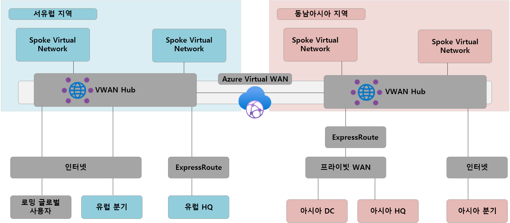
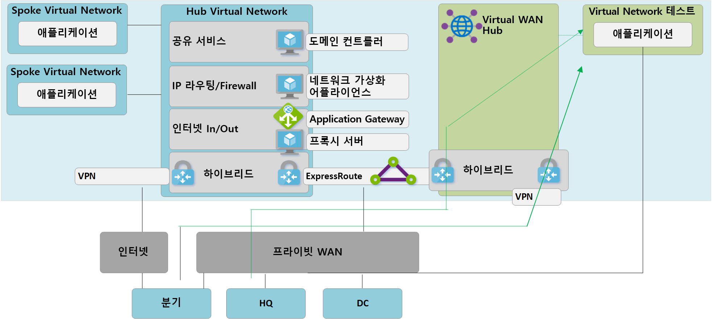
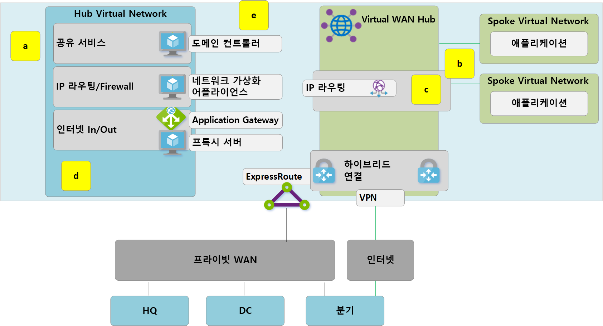
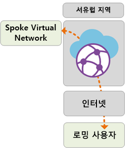

# Azure Virtual WAN으로 마이그레이션
Azure Virtual WAN을 사용하면 회사에서 글로벌 연결을 간소화하고 Microsoft 글로벌 네트워크의 규모를 활용할 수 있습니다. 이 백서에서는 기존의 고객 관리형 허브 및 스포크 토폴로지에서 Microsoft 관리형 Virtual WAN 허브를 활용하는 설계로 마이그레이션하려는 회사에 대한 기술 세부 정보를 제공합니다.

[글로벌 전송 네트워크 아키텍처 및 Virtual WAN](virtual-wan-global-transit-network-architecture.md) 문서에서는 클라우드 중심의 최신 글로벌 네트워크를 채택하는 회사에 제공되는 Azure Virtual WAN의 이점을 강조합니다.

**그림 1: Azure Virtual WAN**

Azure VDC(가상 데이터 센터) 허브 및 스포크 연결 모델은 수천 명의 고객이 Azure 네트워킹의 기본 전환 라우팅 동작을 활용하여 간단하고 확장 가능한 클라우드 네트워크를 구축하기 위해 채택되었습니다. Azure Virtual WAN은 이러한 개념을 기반으로 하며, 온-프레미스 위치와 Azure 간의 글로벌 연결 토폴로지를 허용할 뿐만 아니라 고객이 Microsoft 네트워크의 규모를 활용하여 기존 글로벌 네트워크를 확장할 수 있는 새로운 기능을 도입하고 있습니다.

이 문서에서는 기존 하이브리드 환경을 Virtual WAN으로 마이그레이션하는 방법에 대해 설명합니다.

## 시나리오

Contoso는 유럽과 아시아 지역에 사무소가 있는 글로벌 금융 조직입니다. 기존 애플리케이션을 온-프레미스 데이터 센터에서 Azure로 전환하려고 하며, 하이브리드 연결을 위한 지역별 고객 관리형 허브 가상 네트워크를 포함하여 VDC 아키텍처를 기반으로 하는 기초 설계를 구축했습니다. 클라우드 기반 기술로 전환하는 과정의 일환으로 네트워크 팀에서 비즈니스의 성장에 맞게 연결을 최적화해야 합니다.

그림 2에서는 여러 Azure 지역에 대한 연결을 포함하여 기존 글로벌 네트워크에 대한 개략적인 보기를 보여 줍니다.

**그림 2: Contoso 기존 네트워크 토폴로지**

기존 네트워크 토폴로지에서 이해할 수 있는 사항은 다음과 같습니다.
 
- 허브 앤 스포크 토폴로지는 ExpressRoute Premium 회로를 포함하여 여러 지역에서 공용 개인 WAN으로 다시 연결하는 데 사용됩니다.
- 이러한 사이트 중 일부에는 Microsoft Cloud 내에서 호스팅되는 애플리케이션에 도달하기 위해 Azure에 직접 연결되는 VPN 터널도 있습니다.

## 요구 사항
네트워킹 팀은 클라우드로의 Contoso 마이그레이션을 지원할 수 있는 글로벌 네트워크 모델을 제공했으며, 비용, 규모 및 성능 영역에서 최적화해야 합니다. 요약하면, 다음 요구 사항이 충족되어야 합니다.
- 클라우드 호스팅 애플리케이션에 최적화된 경로를 HQ(본사)와 지점 모두에 제공합니다. 
- 다음 연결 경로를 유지하면서 VPN 종료에 대한 기존 온-프레미스 DC(데이터 센터)의 의존도를 제거합니다.
    - **분기-VNet**: VPN 연결 사무소에서 로컬 Azure 지역의 클라우드로 마이그레이션된 애플리케이션에 액세스할 수 있어야 합니다.
    - **분기-허브-허브-VNet**: VPN 연결 사무소에서 원격 Azure 지역의 클라우드로 마이그레이션된 애플리케이션에 액세스할 수 있어야 합니다. 
    - **분기-분기**: 지역 VPN 연결 사무소에서 서로 간에 통신하고, ExpressRoute 연결 HQ/DC 사이트와 통신할 수 있어야 합니다. 
    - **분기-허브-허브-분기**: 전역적으로 분리된 VPN 연결 사무소에서 서로 간에 통신하고, 모든 ExpressRoute 연결 HQ/DC 사이트와 통신할 수 있어야 합니다.
    - **분기-인터넷**: 연결된 사이트에서 인터넷과 통신할 수 있어야 하며, 이 트래픽을 필터링하고 기록해야 합니다.
    - **VNet-VNet**: 동일한 지역의 스포크 가상 네트워크에서 서로 간에 통신할 수 있어야 합니다.
    - **VNet-허브-허브-VNet**: 다른 지역의 스포크 가상 네트워크에서 서로 간에 통신할 수 있어야 합니다.
- Contoso 로밍 사용자(랩톱 및 휴대폰)가 회사 네트워크가 아니라 회사 리소스에 액세스할 수 있는 기능을 제공합니다.

## Azure Virtual WAN 아키텍처

그림 3에서는 이전 섹션에서 자세히 설명한 요구 사항을 충족하기 위해 Azure Virtual WAN을 사용하는 업데이트된 대상 토폴로지에 대한 개략적인 보기를 보여 줍니다.

**그림 3: Azure Virtual WAN 아키텍처**

요약하면 다음과 같습니다. 
- 유럽의 HQ는 ExpressRoute 연결 상태를 유지하고, 유럽 온-프레미스 DC는 Azure로 완전히 마이그레이션되어 현재 서비스 해제되었습니다.
- 아시아 DC 및 HQ는 프라이빗 WAN 연결 상태를 유지합니다. Azure Virtual WAN은 이제 로컬 이동 통신 사업자 네트워크를 보강하고 글로벌 연결을 제공하는 데 사용됩니다. 
- Azure Virtual WAN 허브는 서유럽 및 동남 아시아 Azure 지역에 모두 배포되어 ExpressRoute 및 VPN 연결 디바이스에 대한 연결 허브를 제공합니다. 
- 허브는 글로벌 메시 네트워크에 대한 OpenVPN 연결을 사용하여 여러 클라이언트 유형에서 로밍 사용자에게 VPN 종료도 제공하므로, Azure로 마이그레이션된 애플리케이션뿐만 아니라 온-프레미스에 남아 있는 모든 리소스에도 액세스할 수 있습니다. 
- Azure Virtual WAN에서 가상 네트워크 내의 리소스에 대한 인터넷 연결을 제공합니다. Azure Virtual WAN에서 원격 사이트에 대한 인터넷 연결도 제공합니다. Office 365와 같은 SaaS 서비스에 대한 액세스를 최적화하기 위해 파트너 통합을 통해 로컬 인터넷 분리가 지원됩니다.

## Azure Virtual WAN으로 마이그레이션

이 섹션에서는 Azure Virtual WAN으로 마이그레이션하는 다양한 단계에 대해 설명합니다.
 
### VDC 허브 및 스포크 단일 지역

다음 그림에서는 Azure Virtual WAN을 출시하기 전의 Contoso에 대한 단일 지역 토폴로지를 보여 줍니다.

 **그림 4: VDC 허브 및 스포크 단일 지역 - 1단계**

VDC(가상 데이터 센터) 접근 방식에 따라 고객 관리형 허브 가상 네트워크에는 다음과 같은 몇 가지 기능 블록이 포함됩니다.
- Contoso에서 사용하는 한 가지 예인 공유 서비스(여러 스포크에 필요한 일반 기능)는 IaaS(Infrastructure-as-a-Service) 가상 머신의 Windows Server 도메인 컨트롤러입니다.
- IP/라우팅 방화벽 서비스는 타사 네트워크 가상 어플라이언스에서 제공하며, 스포크-스포크 계층 3 IP 라우팅이 가능합니다. 
- 인터넷 리소스에 대해 필터링된 아웃바운드 액세스를 위해 가상 머신에서 실행되는 인바운드 HTTPS 요청 및 타사 프록시 서비스에 대한 Azure Application Gateway를 포함한 인터넷 수신/송신 서비스입니다.
- 온-프레미스 네트워크에 연결하기 위한 ExpressRoute 및 VPN Virtual Network Gateway

### Virtual WAN 허브 배포

첫 번째 단계는 Virtual WAN 허브를 각 지역에 배포하는 것입니다. 다음 문서에서 설명한 대로 VPN Gateway 및 ExpressRoute Gateway를 사용하여 Virtual WAN 허브를 설정합니다.  
- [자습서: Azure Virtual WAN을 사용하여 사이트 간 연결 만들기](virtual-wan-site-to-site-portal.md)
- [자습서: Azure Virtual WAN을 사용하여 ExpressRoute 연결 만들기](virtual-wan-expressroute-portal.md) 

> [!NOTE]
> 이 문서에서 설명하는 트래픽 경로 중 일부를 사용하도록 설정하려면 Azure Virtual WAN에서 표준 SKU를 사용하고 있어야 합니다.

**그림 5: VDC 허브 및 스포크-Virtual WAN 마이그레이션 - 2단계**

### 원격 사이트(ExpressRoute 및 VPN)를 Virtual WAN에 연결

이제 Virtual WAN 허브를 기존 ExpressRoute 회로에 연결하고, 인터넷을 통한 사이트 간 VPN을 원격 분기로 설정합니다.

> [!NOTE]
> Virtual WAN 허브에 연결하려면 ExpressRoute 회로를 프리미엄 SKU 유형으로 업그레이드해야 합니다.

**그림 6: VDC 허브 및 스포크-Virtual WAN 마이그레이션 - 3단계**

이 시점에서 온-프레미스 네트워크 장비는 Virtual WAN 관리형 허브 VNet에 할당된 IP 주소 공간을 반영하는 경로를 받기 시작합니다. 이 단계에서 원격 VPN 연결 분기에는 스포크 가상 네트워크의 기존 애플리케이션에 대한 두 가지 경로가 표시됩니다. 이러한 디바이스는 전환 단계에서 대칭 라우팅을 보장하기 위해 VDC 허브에 대한 터널을 계속 사용하도록 구성해야 합니다.

### Virtual WAN을 통한 하이브리드 연결 테스트

관리형 Virtual WAN 허브를 프로덕션 연결에 활용하기 전에 테스트 스포크 가상 네트워크 및 Virtual WAN VNet 연결을 설정하는 것이 좋습니다. 다음 단계를 계속하기 전에 ExpressRoute 및 사이트 간 VPN을 통해 이 테스트 환경에 대한 연결이 작동하는지 확인합니다.

**그림 7: VDC 허브 및 스포크-Virtual WAN 마이그레이션 - 4단계**

### Virtual WAN 허브로의 전환 연결

**그림 8: VDC 허브 및 스포크-Virtual WAN 마이그레이션 - 5단계**

**a**. 스포크 가상 네트워크에서 이전 VDC 허브로의 기존 피어링 연결을 삭제합니다. a-c 단계가 완료될 때까지는 스포크 가상 네트워크의 애플리케이션에 액세스할 수 없습니다.

**b**. VNet 연결을 통해 스포크 가상 네트워크를 Virtual WAN 허브에 연결합니다.

**c**. 스포크-스포크 통신을 위해 이전에 스포크 가상 네트워크 내에서 사용된 모든 UDR(사용자 정의 경로)을 제거합니다. 이 경로는 이제 Virtual WAN 허브 내에서 사용할 수 있는 동적 라우팅을 통해 사용하도록 설정됩니다.

**d**. 다음 (e) 단계를 허용하기 위해 이제 VDC 허브의 기존 ExpressRoute 및 VPN Gateway의 서비스가 해제됩니다.

**e**. 새 VNet 연결을 통해 이전 VDC 허브(허브 가상 네트워크)를 Virtual WAN 허브에 연결합니다.

### 공유 서비스 스포크가 된 이전 허브

이제 Virtual WAN 허브가 새 토폴로지의 중앙 지점이 되도록 Azure 네트워크를 다시 설계했습니다.

**그림 9: VDC 허브 및 스포크-Virtual WAN 마이그레이션 - 6단계**

Virtual WAN 허브는 관리 엔터티이며 가상 머신과 같은 사용자 지정 리소스를 배포할 수 없으므로, 이제 공유 서비스 블록이 스포크 가상 네트워크로 존재하며 Azure Application Gateway 또는 가상화된 네트워크 어플라이언스를 통한 인터넷 수신과 같은 기능을 호스팅합니다. 이제 공유 서비스 환경과 백 엔드 가상 머신 간의 트래픽이 Virtual WAN 관리형 허브를 통과합니다.

### Virtual WAN을 완전히 활용하도록 온-프레미스 연결 최적화

이 단계에서는 Contoso에서 대부분의 비즈니스 애플리케이션을 Microsoft Cloud로 마이그레이션했으며, 몇 가지 레거시 애플리케이션만 온-프레미스 DC 내에 남아 있습니다.

**그림 10: VDC 허브 및 스포크-Virtual WAN 마이그레이션 - 7단계**

 Azure Virtual WAN의 모든 기능을 활용하기 위해 Contoso는 레거시 온-프레미스 VPN 연결의 서비스를 해제하도록 결정합니다. HQ 또는 DC 네트워크에 계속 액세스하는 모든 분기는 Azure Virtual WAN의 기본 제공 전송 라우팅을 사용하여 Microsoft 글로벌 네트워크를 통과할 수 있습니다. 

> [!NOTE]
> ExpressRoute Global Reach는 Microsoft 백본을 활용하여 기존 프라이빗 WAN을 보완하려는 고객을 위한 대체 옵션입니다.

## 최종 상태 아키텍처 및 트래픽 경로

**그림 11: 이중 지역 Virtual WAN**

이 섹션에서는 몇 가지 트래픽 흐름의 예를 살펴보고 이 토폴로지에서 원래의 요구 사항을 충족시키는 방법에 대해 간략히 설명합니다.

### 경로 1

경로 1은 아시아의 S2S VPN으로 연결된 분기에서 동남 아시아 지역의 Azure VNet으로 진행하는 트래픽 흐름을 설명합니다.

트래픽은 다음과 같이 라우팅됩니다.
- 아시아 분기가 탄력적 S2S BGP 사용 터널을 통해 동남 아시아 Virtual WAN 허브에 연결됩니다.
- 아시아 Virtual WAN 허브에서 트래픽을 로컬로 연결된 VNet으로 라우팅합니다.

### 경로 2
경로 2는 ExpressRoute로 연결된 유럽 HQ에서 동남 아시아 지역의 Azure VNet으로 진행하는 트래픽 흐름을 설명합니다.

트래픽은 다음과 같이 라우팅됩니다.
- 유럽 HQ가 Premium ExpressRoute 회로를 통해 서유럽 Virtual WAN 허브에 연결됩니다.
- Virtual WAN 허브-허브 글로벌 연결을 통해 트래픽을 원격 지역에 연결된 VNet으로 전송할 수 있습니다.

### 경로 3
경로 3은 개인 WAN으로 연결된 아시아 온-프레미스 DC에서 유럽 S2S로 연결된 분기로 진행하는 트래픽 흐름을 설명합니다.

트래픽은 다음과 같이 라우팅됩니다.
- 아시아 DC가 로컬 프라이빗 WAN 이동 통신 사업자에 연결됩니다.
- 개인 WAN에서 로컬로 종료되는 ExpressRoute 회로가 동남 아시아 Virtual WAN 허브에 연결됩니다.
- Virtual WAN 허브-허브 글로벌 연결을 통해 트래픽을 전송할 수 있습니다.

### 경로 4
경로 4는 동남 아시아 지역의 Azure VNet에서 서유럽 지역의 Azure VNet으로 진행하는 트래픽 흐름을 설명합니다.

트래픽은 다음과 같이 라우팅됩니다.
- Virtual WAN 허브-허브 글로벌 연결을 통해 추가적인 사용자 구성 없이 연결된 모든 Azure VNet을 기본적으로 통과할 수 있습니다.

### 경로 5
경로 5는 로밍 VPN(P2S) 사용자에게서 서유럽 지역의 Azure VNet으로 진행하는 트래픽 흐름을 설명합니다.

트래픽은 다음과 같이 라우팅됩니다.
- 랩톱 및 모바일 디바이스 사용자가 OpenVPN 클라이언트를 활용하여 서유럽의 P2S VPN 게이트웨이에 투명하게 연결합니다.
- 서유럽 Virtual WAN 허브에서 트래픽을 로컬로 연결된 VNet으로 라우팅합니다.

## Azure Firewall을 통한 보안 및 정책 제어

Contoso는 이제 이 문서의 앞부분에서 설명한 요구 사항에 따라 모든 분기와 VNet 간의 연결을 확인했습니다. 보안 제어 및 네트워크 격리에 대한 요구 사항을 충족하려면 허브 네트워크를 통해 트래픽을 계속 분리하고 로그에 기록해야 합니다. 이전에는 NVA(네트워크 가상 어플라이언스)에서 이 기능을 수행했습니다. 또한 Contoso는 기존 프록시 서비스를 해제하고 네이티브 Azure 서비스를 아웃바운드 인터넷 필터링에 활용하려고 합니다. 

**그림 12: Virtual WAN의 Azure Firewall(보안 가상 허브)**

Azure Firewall을 Virtual WAN 허브에 도입하여 통합된 정책 제어 지점을 사용하도록 설정하려면 다음과 같은 고급 단계가 필요합니다. 이 프로세스와 보안 가상 허브 개념은 [여기](https://go.microsoft.com/fwlink/?linkid=2107683)서 자세히 설명하고 있습니다.
- Azure Firewall 정책을 만듭니다.
- 방화벽 정책을 Azure Virtual WAN 허브에 연결합니다.
- 위의 단계를 수행하면 기존 Virtual WAN 허브가 보안 가상 허브로 작동하고 필요한 Azure Firewall 리소스를 배포할 수 있습니다.

> [!NOTE]
> Azure Firewall이 표준 Virtual WAN 허브(SKU: 표준)에 배포된 경우 V2V, B2V, V2I 및 B2I FW 정책은 Azure FW가 배포된 특정 허브(보안 허브)에 연결된 Vnet 및 분기에서 시작되는 트래픽에만 적용됩니다. 동일한 Virtual WAN의 다른 Virtual WAN 허브에 연결된 원격 Vnet 및 분기가 Virtual WAN 허브를 통해 허브 링크로 상호 연결되어 있더라도 이러한 원격 Vnet 및 분기에서 시작하는 트래픽은 Virtual WAN 허브를 통해 허브 링크로 연결되더라도 "방화벽이 사용되지 않습니다." 허브 간 방화벽 지원은 Azure Virtual WAN 및 Firewall Manager 로드맵에 있습니다.

다음 경로에서는 Azure 보안 가상 허브를 활용하여 사용하도록 설정된 연결 경로에 대해 설명합니다.

### 경로 6
경로 6은 동일한 지역 내의 VNet 간 보안 트래픽 흐름을 설명합니다.

트래픽은 다음과 같이 라우팅됩니다.
- 동일한 보안 가상 허브에 연결된 가상 네트워크에서 이제 Azure Firewall을 통해 트래픽을 라우팅합니다.
- Azure Firewall에서 정책을 이러한 흐름에 적용할 수 있습니다.

### 경로 7
경로 7은 Azure Vnet-인터넷 또는 타사 보안 서비스로 진행하는 트래픽 흐름을 설명합니다.

트래픽은 다음과 같이 라우팅됩니다.
- 보안 가상 허브에 연결된 Virtual Network에서 보안 허브를 인터넷 액세스의 중앙 지점으로 사용하여 트래픽을 인터넷의 퍼블릭 대상으로 보낼 수 있습니다.
- 이 트래픽은 Azure Firewall FQDN 규칙을 사용하여 로컬로 필터링하거나 검사를 위해 타사 보안 서비스로 보낼 수 있습니다.

### 경로 8
경로 8은 분기-인터넷 또는 타사 보안 서비스로부터의 트래픽 흐름을 설명합니다.

트래픽은 다음과 같이 라우팅됩니다.
- 보안 가상 허브에 연결된 분기에서 보안 허브를 인터넷 액세스의 중앙 지점으로 사용하여 트래픽을 인터넷의 퍼블릭 대상으로 보낼 수 있습니다.
- 이 트래픽은 Azure Firewall FQDN 규칙을 사용하여 로컬로 필터링하거나 검사를 위해 타사 보안 서비스로 보낼 수 있습니다.

 

## 다음 단계
[Azure Virtual WAN](virtual-wan-about.md)에 대해 자세히 알아보기
