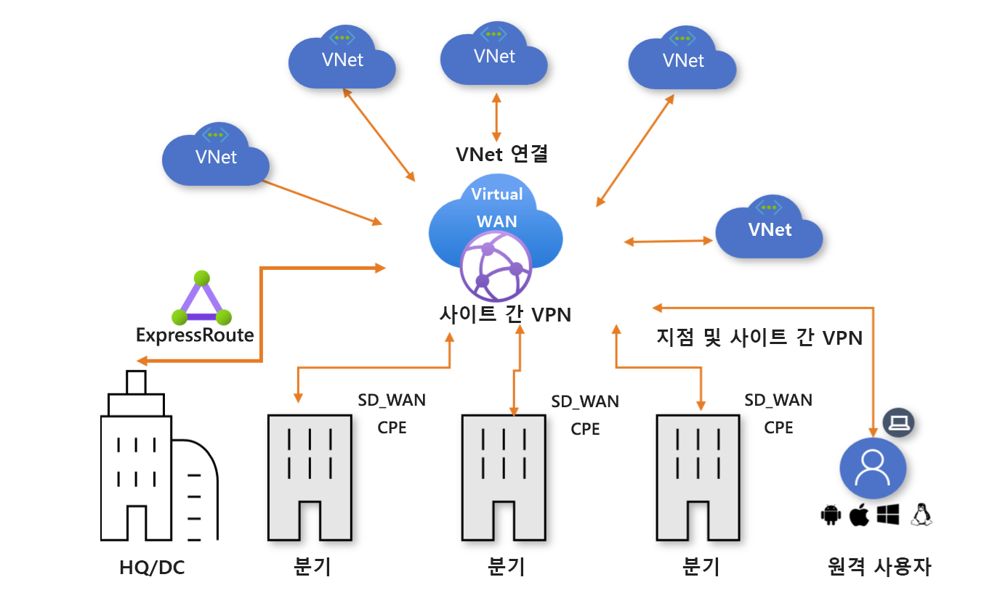

# Azure 가상 WAN 및 원격 작업 지원

>[!NOTE]
>이 문서에서는 Azure 가상 WAN, Azure, Microsoft 네트워크 및 Azure 파트너 에코 시스템을 활용 하 여 원격으로 작업 하 고 COVID-19 위기 때문에 직면 하 고 있는 네트워크 문제를 완화 하는 방법을 설명 합니다.
>

원격 사용자에 대 한 연결을 제공 암호화?
사용자의 요구 사항을 계획 한 것 이상의 사용자에 게 서 지원 해야 하는 경우를 갑자기 확인할 수 있나요?
사용자가 집에서 연결 하 고 클라우드에 액세스할 뿐만 아니라 온-프레미스에 도달할 수 있어야 하나요?
개인 WAN 뒤에 있는 리소스에 연결할 수 있도록 원격 사용자가 필요 한가요?
사용자가 지역 간에 연결을 설정할 필요 없이 클라우드 리소스에 액세스할 수 있어야 하나요?
이 글로벌 전염병는 미국에 대 한 전례 없는 변경 내용을 만들기 때문에 연결 요구에 맞게 Azure Virtual WAN 팀을 사용할 수 있습니다.

Azure 가상 WAN은 여러 네트워킹, 보안 및 라우팅 기능을 결합 하 여 단일 운영 인터페이스를 제공 하는 네트워킹 서비스입니다. 이러한 기능에는 분기 연결 (SD WAN 또는 VPN CPE와 같은 가상 WAN 파트너 장치에서 연결 자동화를 통해), 사이트 간 VPN 연결, 원격 사용자 VPN (지점 및 사이트 간) 연결, 개인 (Express 경로) 연결, 클라우드 연결 (가상 네트워크에 대 한 전이적 연결), VPN Express 경로 상호 연결과, 라우팅, Azure 방화벽, 개인 연결용 암호화 등이 포함 됩니다. 가상 WAN 사용을 시작 하는 데 이러한 사용 사례가 모두 필요 하지는 않습니다. 사용 사례를 하나만 시작 하 고 진화 하는 대로 네트워크를 조정할 수 있습니다.

이제 원격 사용자에 대해 이야기 하 고 네트워크를 실행 하는 데 필요한 사항을 살펴보세요.

## 원격 사용자 연결 설정

IPsec/IKE(IKEv2) 또는 OpenVPN 연결을 통해 Azure의 리소스에 연결할 수 있습니다. 이 유형의 연결을 사용 하려면 원격 사용자에 대해 VPN 클라이언트를 구성 해야 합니다. 이 클라이언트는 [AZURE vpn 클라이언트](https://go.microsoft.com/fwlink/?linkid=2117554) 또는 openvpn 클라이언트 이거나 IKEv2를 지 원하는 모든 클라이언트 일 수 있습니다. 자세한 내용은 [지점 및 사이트 간 연결 만들기](virtual-wan-point-to-site-portal.md)를 참조하세요.

## 원격 사용자에서 온-프레미스로의 연결

여기에는 두 가지 옵션이 있습니다.

* 기존 VPN 장치를 사용 하 여 사이트 간 연결을 설정 합니다. IPsec VPN 장치를 Azure 가상 WAN 허브에 연결 하는 경우 지점 및 사이트 간 사용자 VPN (원격 사용자)과 사이트 간 VPN 간의 상호 연결과가 자동으로 사용 됩니다. 온-프레미스 VPN 장치에서 Azure 가상 WAN으로 사이트 간 VPN을 설정 하는 방법에 대 한 자세한 내용은 [가상 wan을 사용 하 여 사이트 간 연결 만들기](virtual-wan-site-to-site-portal.md)를 참조 하세요.

* Express 경로 회로를 가상 WAN 허브에 연결 합니다. Express 경로 회로에 연결 하려면 가상 WAN에서 Express 경로 게이트웨이를 배포 해야 합니다. 하나를 배포 하는 즉시 지점 및 사이트 간 사용자 VPN과 Express 경로 사용자 간 상호 연결과는 자동입니다. Express 경로 연결을 만들려면 [가상 WAN을 사용 하 여 express 경로 연결 만들기](virtual-wan-expressroute-portal.md)를 참조 하세요. 기존 Express 경로 회로를 사용 하 여 Azure 가상 WAN에 연결할 수 있습니다.

## 기존 기본 가상 WAN 고객

기본 가상 WAN은 사이트 간 VPN만 제공 합니다. 원격 사용자가 연결할 수 있도록 하려면 가상 WAN을 표준 가상 WAN으로 업그레이드 해야 합니다. 가상 WAN을 업그레이드 하는 단계는 [기본에서 표준으로 가상 Wan 업그레이드](upgrade-virtual-wan.md) 를 참조 하세요.

## 추가 정보

가상 WAN은 지역/위치 당 하나의 허브를 지원 합니다. 위치 정보는 [Virtual WAN 파트너 및 위치](virtual-wan-locations-partners.md) 문서를 참조하세요. 각 허브는 최대 1만 개의 원격 사용자 연결, 1000 분기 연결, 4 개의 Express 경로 회로 및 최대 500 Virtual Network 연결을 지원 합니다. 원격 사용자를 확장할 때 질문이 있는 경우에는에 azurevirtualwan@microsoft.com전자 메일을 보내 도움을 주저 마세요. 기술 지원이 필요한 경우 Azure Portal에서 지원 티켓을 열어야 합니다 .이에 대 한 도움을 받을 수 있어야 합니다.

## FAQ

[!INCLUDE [Virtual WAN FAQ](../../includes/virtual-wan-faq-include.md)]

## 다음 단계

가상 WAN에 대 한 자세한 내용은 [가상 wan 개요](virtual-wan-about.md) 를 참조 하세요.