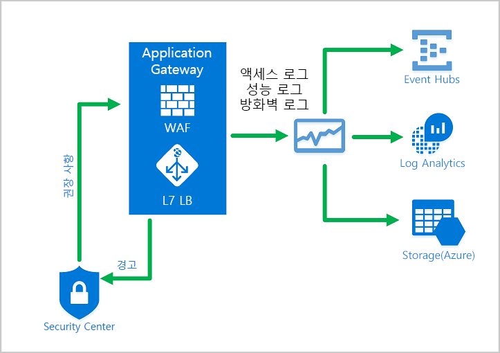
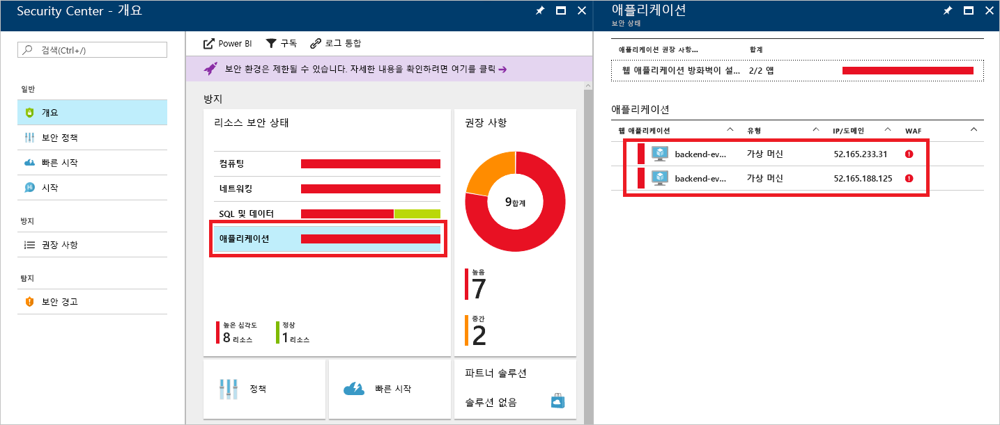

# <a name="what-is-azure-web-application-firewall-on-azure-application-gateway"></a>Azure Application Gateway의 Azure 웹 애플리케이션 방화벽이란?

Azure Application Gateway의 Azure WAF(웹 애플리케이션 방화벽)는 일반적인 악용 및 취약성으로부터 웹 애플리케이션을 중앙 집중식으로 보호합니다. 일반적으로 알려진 취약성을 악용하여 웹 애플리케이션을 공격하는 악의적인 사례가 점점 늘어나고 있습니다. 그 중에서 SQL 삽입 및 사이트 간 스크립팅은 가장 흔한 공격 방식입니다.

Application Gateway의 WAF는 OWASP(Open Web Application Security Project)의 [CRS(핵심 규칙 세트)](https://owasp.org/www-project-modsecurity-core-rule-set/) 3.1, 3.0 또는 2.2.9를 기반으로 합니다. WAF는 새로운 취약점에 대한 방어 기능을 포함하도록 자동으로 업데이트되며, 추가 구성이 필요 없습니다. 

아래에 나열된 모든 WAF 기능은 WAF 정책 내에 있습니다. 여러 정책을 만들 수 있으며, 정책을 Application Gateway, 개별 수신기 또는 Application Gateway의 경로 기반 회람 규칙에 연결할 수 있습니다. 이러한 방식으로 필요에 따라 Application Gateway 뒤에 있는 각 사이트에 별도의 정책을 적용할 수 있습니다. WAF 정책에 대한 자세한 내용은 [WAF 정책 만들기](create-waf-policy-ag.md)를 참조하세요.


Application Gateway는 많은 ADC(애플리케이션 배달 컨트롤러)로 작동합니다. 이전에 SSL(Secure Sockets Layer)로 알려진 TLS(Transport Layer Security) 종료, 쿠키 기반 세션 선호도, 라운드 로빈 부하 분산, 콘텐츠 기반 라우팅, 다중 웹 사이트 호스트 및 향상된 보안 기능을 제공합니다.

Application Gateway의 향상된 보안 기능으로는 TLS 정책 관리와 엔드투엔드 TLS 지원이 있습니다. 애플리케이션 보안은 Application Gateway에 WAF를 통합하여 강화됩니다. 이 조합은 일반적인 취약성으로부터 웹 애플리케이션을 보호합니다. 그리고 구성이 간편한 중앙의 위치에서 관리할 수 있습니다.

## <a name="benefits"></a>이점

이 섹션에서는 Application Gateway의 WAF가 제공하는 핵심 이점에 대해 설명합니다.

### <a name="protection"></a>보호

* 백 엔드 코드를 수정하지 않고 웹 취약점 및 공격으로부터 웹 애플리케이션을 보호합니다.

* 동시에 여러 웹 애플리케이션을 보호합니다. Application Gateway 인스턴스는 웹 애플리케이션 방화벽으로 보호되는 최대 40개의 웹 사이트를 호스팅할 수 있습니다.

* 동일한 WAF 뒤에 있는 다른 사이트에 대한 사용자 지정 WAF 정책을 만듭니다. 

* IP 신뢰도 규칙 세트를 사용하여 악의적인 봇으로부터 웹 애플리케이션을 보호합니다(미리 보기).

### <a name="monitoring"></a>모니터링

* 실시간 WAF 로그를 사용하여 웹 애플리케이션에 대한 공격을 모니터링합니다. 이 로그는 [Azure Monitor](../../azure-monitor/overview.md)와 통합되어 WAF 경고를 추적하고 추세를 쉽게 모니터링합니다.

* Application Gateway WAF는 Azure Security Center와 통합됩니다. 중앙의 Security Center에서 모든 Azure 리소스의 보안 상태를 살펴볼 수 있습니다.

### <a name="customization"></a>사용자 지정

* 애플리케이션 요구 사항에 맞게 WAF 규칙 및 규칙 그룹을 사용자 지정하고 가양성을 제거합니다.

* 사이트별로 구성할 수 있도록 WAF 뒤에 있는 각 사이트에 대한 WAF 정책을 연결합니다.

* 애플리케이션의 요구 사항에 맞는 사용자 지정 규칙을 만듭니다.

## <a name="features"></a>기능

- SQL 삽입 방지
- 사이트 간 스크립팅 방지
- 명령 삽입, HTTP 요청 밀반입, HTTP 응답 분할, 원격 파일 포함 등의 일반 웹 공격 방지
- HTTP 프로토콜 위반으로부터 보호
- 누락된 호스트 사용자-에이전트 및 accept 헤더 같은 HTTP 프로토콜 이상 보호
- 크롤러 및 스캐너에 대한 방지
- 일반적인 애플리케이션 구성 오류(예: Apache 및 IIS) 검색
- 하한값과 상한값이 있는 구성 가능한 요청 크기 제한
- WAF 평가에서 특정 요청 특성을 생략할 수 있는 제외 목록. 일반적인 예로는 인증 또는 암호 필드에 사용되는 Active Directory 삽입 토큰이 있습니다.
- 애플리케이션의 특정 요구 사항에 맞는 사용자 지정 규칙 만들기
- 특정 국가/지역의 애플리케이션에 대한 액세스를 허용하거나 차단하기 위한 지역 필터 트래픽. (미리 보기)
- 봇 완화 규칙 세트를 사용하여 봇으로부터 애플리케이션 보호 (미리 보기)
- 요청 본문에서 JSON 및 XML 검사

## <a name="waf-policy-and-rules"></a>WAF 정책 및 규칙

Application Gateway에서 웹 애플리케이션 방화벽을 사용하도록 설정하려면 WAF 정책을 만들어야 합니다. 이 정책에는 모든 관리형 규칙, 사용자 지정 규칙, 제외 및 기타 사용자 지정(예: 파일 업로드 제한)이 있습니다.

WAF 정책을 구성한 후 보호를 위해 하나 이상의 애플리케이션 게이트웨이에 이 정책을 연결할 수 있습니다. WAF 정책은 다음 두 가지 유형의 보안 규칙으로 구성됩니다.

- 사용자가 만든 사용자 지정 규칙

- Azure에서 관리하는 미리 구성된 규칙 집합의 컬렉션에 해당하는 관리형 규칙 집합

두 규칙이 모두 존재하는 경우 관리형 규칙 세트의 규칙을 처리하기 전에 사용자 지정 규칙이 처리됩니다. 규칙은 일치 조건, 우선 순위 및 작업으로 구성됩니다. 지원되는 작업 유형은 ALLOW, BLOCK, LOG입니다. 관리형 규칙과 사용자 지정 규칙을 결합하여 특정 애플리케이션 보호 요구 사항을 충족하는 완전히 사용자 지정된 정책을 만들 수 있습니다.

정책 내 규칙은 우선 순위에 따라 처리됩니다. 우선 순위는 처리할 규칙의 순서를 정의하는 고유한 정수입니다. 정수 값이 작을수록 우선 순위가 높고 이러한 규칙은 정수 값이 높은 규칙보다 먼저 평가됩니다. 규칙이 일치하면 규칙에 정의된 해당 작업이 요청에 적용됩니다. 이러한 일치가 처리되면 우선 순위가 낮은 규칙은 더 이상 처리되지 않습니다.

Application Gateway에서 제공하는 웹 애플리케이션에는 전역 수준, 사이트 별 수준 또는 URI별 수준에서 연결된 WAF 정책이 있을 수 있습니다.

### <a name="core-rule-sets"></a>핵심 규칙 집합

Application Gateway는 세 가지 규칙 세트 CRS 3.1, CRS 3.0 및 CRS 2.2.9를 지원합니다. 이러한 규칙은 악의적인 활동으로부터 웹 애플리케이션을 보호합니다.

자세한 내용은 [웹 애플리케이션 방화벽 CRS 규칙 그룹 및 규칙](application-gateway-crs-rulegroups-rules.md)을 참조하세요.

### <a name="custom-rules"></a>사용자 지정 규칙

Application Gateway는 사용자 지정 규칙도 지원합니다. 사용자 지정 규칙을 사용하면 WAF를 통해 전달되는 각 요청에 대해 평가되는 사용자 고유의 규칙을 만들 수 있습니다. 이러한 규칙은 관리형 규칙 세트의 나머지 규칙보다 높은 우선 순위를 갖습니다. 조건 세트가 충족되면 허용 또는 차단 작업을 수행합니다. 

이제 geomatch 연산자는 사용자 지정 규칙에 대한 공개 미리 보기에서 사용할 수 있습니다. 자세한 내용은 [geomatch 사용자 지정 규칙](custom-waf-rules-overview.md#geomatch-custom-rules-preview)을 참조하세요.

> [!NOTE]
> 사용자 지정 규칙에 대한 geomatch 연산자는 현재 공개 미리 보기 상태이며 미리 보기 서비스 수준 계약과 함께 제공됩니다. 특정 기능이 지원되지 않거나 기능이 제한될 수 있습니다. 자세한 내용은 [Microsoft Azure 미리 보기에 대한 보충 사용 약관](https://azure.microsoft.com/support/legal/preview-supplemental-terms/)을 참조하세요.

사용자 지정 규칙에 대한 자세한 내용은 [Application Gateway에 대한 사용자 지정 규칙](custom-waf-rules-overview.md)을 참조하세요.

### <a name="bot-mitigation-preview"></a>봇 완화(미리 보기)

관리형 규칙 세트와 함께 관리형 봇 보호 규칙 세트를 WAF에 사용하도록 설정하여 알려진 악성 IP 주소의 요청을 차단하거나 기록할 수 있습니다. IP 주소는 Microsoft 위협 인텔리전스 피드에서 제공됩니다. Intelligent Security Graph는 Microsoft 위협 인텔리전스를 구동하며 Azure Security Center를 비롯한 여러 서비스에서 사용됩니다.

> [!NOTE]
> 봇 보호 규칙 세트는 현재 공개 미리 보기이며 미리 보기 서비스 수준 계약과 함께 제공됩니다. 특정 기능이 지원되지 않거나 기능이 제한될 수 있습니다. 자세한 내용은 [Microsoft Azure 미리 보기에 대한 보충 사용 약관](https://azure.microsoft.com/support/legal/preview-supplemental-terms/)을 참조하세요.

봇 보호를 사용하면 악의적 봇의 클라이언트 IP와 일치하는 수신 요청이 방화벽 로그에 기록됩니다. 자세한 내용은 아래를 참조하세요. 스토리지 계정, 이벤트 허브 또는 로그 분석에서 WAF 로그에 액세스할 수 있습니다. 

### <a name="waf-modes"></a>WAF 모드

Application Gateway WAF는 다음 두 가지 모드에서 실행되도록 구성할 수 있습니다.

* **탐지 모드**: 모든 위협 경고를 모니터링하고 기록합니다. **진단** 섹션에서 Application Gateway에 대한 진단 로깅을 켜야 합니다. 그리고 WAF 로그가 선택되어 있고 켜져 있는지 확인해야 합니다. 웹 애플리케이션 방화벽을 탐지 모드로 실행하면 수신 요청을 차단하지 않습니다.
* **방지 모드**: 규칙에서 탐지하는 침입 및 공격을 차단합니다. 공격자는 "403 무단 액세스" 예외를 수신하고, 연결이 종료됩니다. 방지 모드는 이러한 공격을 WAF 로그에 기록합니다.

> [!NOTE]
> 새로 배포된 WAF를 프로덕션 환경에서 짧은 시간 동안 탐지 모드로 실행하는 것이 좋습니다. 이렇게 하면 방지 모드로 전환하기 전에 [방화벽 로그](../../application-gateway/application-gateway-diagnostics.md#firewall-log)를 얻고 모든 예외 또는 [사용자 지정 규칙](./custom-waf-rules-overview.md)을 업데이트할 수 있습니다. 이를 통해 예기치 않은 트래픽 차단 발생을 줄일 수 있습니다.

### <a name="anomaly-scoring-mode"></a>변칙 채점 모드

OWASP는 트래픽 차단 여부를 결정하는 기존 모드와 변칙 채점 모드 두 가지가 있습니다.

기존 모드에서는 특정 규칙과 일치하는 트래픽은 다른 규칙과 상관없이 일치 항목으로 간주됩니다. 이 모드는 이해하기 쉽습니다. 그러나 특정 요청과 일치하는 규칙이 몇 개인지 알 수 없다는 제한이 있습니다. 이러한 제한을 극복하기 위해 변칙 채점 모드가 도입되었습니다. 변칙 채점 모드는 OWASP 3.*x* 의 기본값입니다.

변칙 채점 모드에서는 방화벽이 방지 모드일 때 특정 규칙과 일치하는 트래픽이 즉시 차단되지 않습니다. 규칙에는 네 가지 심각도 *중요*, *오류*, *경고* 또는 *알림* 이 있습니다. 이 심각도는 요청의 숫자 값에 영향을 주며, 이것을 변칙 점수라고 합니다. 예를 들어 *경고* 규칙 일치 항목 하나당 3점입니다. *중요* 규칙 일치 항목 하나당 5점입니다.

|심각도  |값  |
|---------|---------|
|위험     |5|
|Error        |4|
|Warning      |3|
|알림       |2|

변칙 점수가 트래픽을 차단하는 임계값은 5입니다. 따라서 *중요* 규칙 일치 항목이 하나만 있어도 Application Gateway WAF가 방지 모드에서도 요청을 차단합니다. 하지만 *경고* 규칙 일치 항목이 하나 있으면 변칙 점수가 3 증가하므로 트래픽을 차단하기에는 점수가 부족합니다.

> [!NOTE]
> WAF 규칙이 트래픽과 일치할 때 기록되는 메시지에는 "차단됨" 작업 값이 포함됩니다. 그러나 실제로 트래픽은 변칙 점수가 5 이상인 경우에만 차단됩니다. 자세한 내용은 [Azure Application Gateway용 WAF(Web Application Firewall) 문제 해결](web-application-firewall-troubleshoot.md#understanding-waf-logs)을 참조하세요. 

### <a name="waf-monitoring"></a>WAF 모니터링

Application Gateway의 상태를 모니터링하는 것이 중요합니다. WAF 및 WAF가 보호하는 애플리케이션의 상태를 모니터링하는 기능은 Azure Security Center, Azure Monitor 및 Azure Monitor 로그와의 통합을 통해 제공됩니다.



#### <a name="azure-monitor"></a>Azure Monitor

Application Gateway 로그는 [Azure Monitor](../../azure-monitor/overview.md)와 통합됩니다. 이를 통해 WAF 경고 및 로그를 포함하여 진단 정보를 추적할 수 있습니다. 포털에 있는 Application Gateway 리소스의 **진단** 탭에서 또는 Azure Monitor를 통해 직접 이 기능에 액세스할 수 있습니다. 로그를 사용하도록 설정하는 방법에 대한 자세한 내용은 [Application Gateway 진단](../../application-gateway/application-gateway-diagnostics.md)을 참조하세요.

#### <a name="azure-security-center"></a>Azure Security Center

[Security Center](../../security-center/security-center-introduction.md)를 통해 위협을 예방하고, 탐지하고, 대응할 수 있습니다. Security Center를 사용하면 Azure 리소스의 보안 상태를 보다 명확히 파악하고 제어할 수 있습니다. Application Gateway는 [Security Center와 통합됩니다](../../security-center/security-center-partner-integration.md#integrated-azure-security-solutions). Security Center는 사용자 환경을 검사하여 보호되지 않는 웹 애플리케이션을 검색합니다. 이처럼 취약한 리소스를 보호하도록 애플리케이션 게이트웨이 WAF를 권장할 수 있습니다. Security Center에서 직접 방화벽을 만듭니다. 이러한 WAF 인스턴스는 Security Center와 통합됩니다. WAF 인스턴스는 경고와 상태 정보를 Security Center로 보내서 보고합니다.



#### <a name="azure-sentinel"></a>Azure Sentinel

Microsoft Azure Sentinel은 확장 가능한 클라우드 네이티브, SIEM(보안 정보 이벤트 관리) 및 SOAR(보안 오케스트레이션 자동화 응답) 솔루션입니다. Azure Sentinel은 엔터프라이즈 전반에 지능적인 보안 분석 및 위협 인텔리전스를 제공하며, 경고 검색, 위협 가시성, 주도적 헌팅 및 위협 대응을 위한 단일 솔루션을 제공합니다.

기본 제공 Azure WAF 방화벽 이벤트 통합 문서를 사용하면 WAF의 보안 이벤트에 대한 개요를 볼 수 있습니다. 여기에는 이벤트, 일치 규칙 및 차단 규칙 및 방화벽 로그에 기록되는 모든 항목이 포함됩니다. 로깅에 대해 아래에서 자세히 참조하세요. 


#### <a name="azure-monitor-workbook-for-waf"></a>WAF용 Azure Monitor 통합 문서

이 통합 문서를 사용하면 필터링 가능한 여러 패널에서 보안 관련 WAF 이벤트를 사용자 지정 시각화할 수 있습니다. Application Gateway, Front Door 및 CDN을 비롯한 모든 WAF 형식에서 작동하며 WAF 유형 또는 특정 WAF 인스턴스를 기반으로 필터링할 수 있습니다. ARM 템플릿 또는 갤러리 템플릿을 통해 가져옵니다. 이 통합 문서를 배포하려면 [WAF 통합 문서](https://aka.ms/AzWAFworkbook)를 참조하세요.

#### <a name="logging"></a>로깅

Application Gateway WAF는 탐지된 각 위협에 대한 상세 보고를 제공합니다. 로깅은 Azure Diagnostics 로그와 통합됩니다. 경고는 .json 형식으로 기록됩니다. 이러한 로그는 [Azure Monitor 로그](../../azure-monitor/insights/azure-networking-analytics.md)와 통합될 수 있습니다.


```json
{
  "resourceId": "/SUBSCRIPTIONS/{subscriptionId}/RESOURCEGROUPS/{resourceGroupId}/PROVIDERS/MICROSOFT.NETWORK/APPLICATIONGATEWAYS/{appGatewayName}",
  "operationName": "ApplicationGatewayFirewall",
  "time": "2017-03-20T15:52:09.1494499Z",
  "category": "ApplicationGatewayFirewallLog",
  "properties": {
    {
      "instanceId": "ApplicationGatewayRole_IN_0",
      "clientIp": "52.161.109.145",
      "clientPort": "0",
      "requestUri": "/",
      "ruleSetType": "OWASP",
      "ruleSetVersion": "3.0",
      "ruleId": "920350",
      "ruleGroup": "920-PROTOCOL-ENFORCEMENT",
      "message": "Host header is a numeric IP address",
      "action": "Matched",
      "site": "Global",
      "details": {
        "message": "Warning. Pattern match \"^[\\\\d.:]+$\" at REQUEST_HEADERS:Host ....",
        "data": "127.0.0.1",
        "file": "rules/REQUEST-920-PROTOCOL-ENFORCEMENT.conf",
        "line": "791"
      },
      "hostname": "127.0.0.1",
      "transactionId": "16861477007022634343"
      "policyId": "/subscriptions/1496a758-b2ff-43ef-b738-8e9eb5161a86/resourceGroups/drewRG/providers/Microsoft.Network/ApplicationGatewayWebApplicationFirewallPolicies/globalWafPolicy",
      "policyScope": "Global",
      "policyScopeName": " Global "
    }
  }
} 

```

## <a name="application-gateway-waf-sku-pricing"></a>Application Gateway WAF SKU 가격 책정

WAF_v1 및 WAF_v2 SKU의 가격 책정 모델이 서로 다릅니다. 자세한 내용은 [Application Gateway 가격 책정](https://azure.microsoft.com/pricing/details/application-gateway/) 페이지를 참조하세요. 

## <a name="whats-new"></a>새로운 기능

Azure 웹 애플리케이션 방화벽의 새로운 기능을 알아보려면 [Azure 업데이트](https://azure.microsoft.com/updates/?category=networking&query=Web%20Application%20Firewall)를 참조하세요.

## <a name="next-steps"></a>다음 단계

- [WAF 관리 규칙](application-gateway-crs-rulegroups-rules.md)에 대해 자세히 알아보기
- [사용자 지정 규칙](custom-waf-rules-overview.md)에 대해 자세히 알아보기
- [Azure Front Door의 웹 애플리케이션 방화벽](../afds/afds-overview.md)에 대한 자세한 내용
