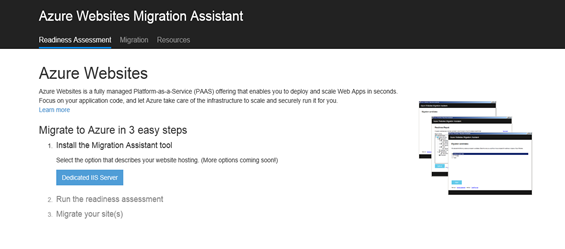
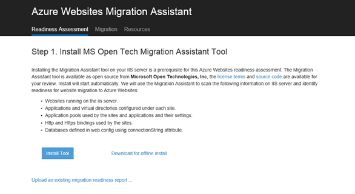
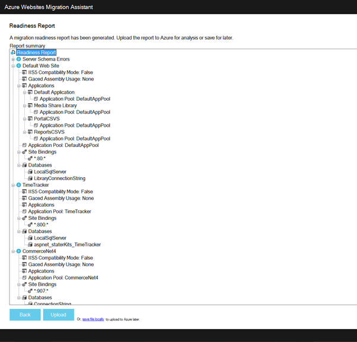
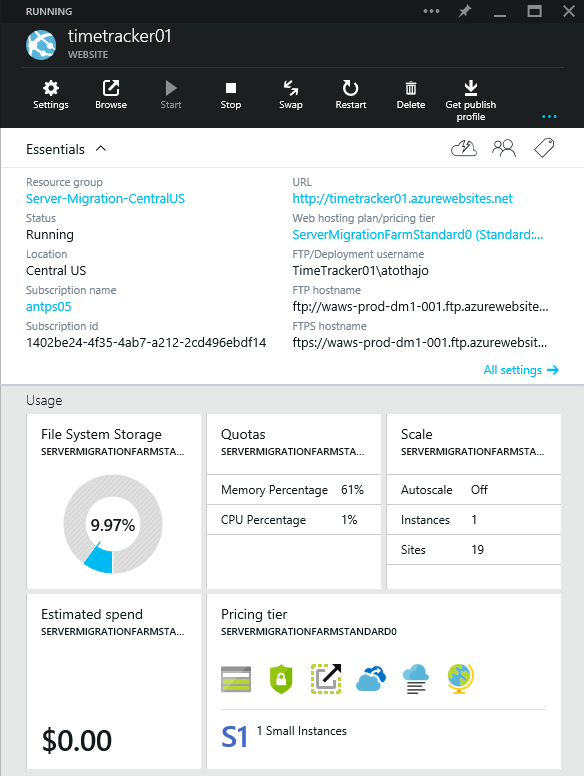

<properties 
	pageTitle="Azure 앱 서비스에서 엔터프라이즈 웹 앱 마이그레이션" 
	description="Web App Migration Assistant를 사용하여 기존 IIS 웹 사이트를 Azure 앱 서비스 웹 앱으로 신속하게 마이그레이션하는 방법을 보여 줍니다." 
	services="app-service\web" 
	documentationCenter="" 
	authors="cephalin" 
	writer="cephalin" 
	manager="wpickett" 
	editor=""/>

<tags 
	ms.service="app-service-web" 
	ms.workload="web" 
	ms.tgt_pltfrm="na" 
	ms.devlang="na" 
	ms.topic="article" 
	ms.date="03/24/2015" 
	ms.author="cephalin"/>

# Azure 앱 서비스에서 엔터프라이즈 웹 앱 마이그레이션

IIS(인터넷 정보 서비스) 6 이상을 실행하는 기존 웹 사이트를 [앱 서비스 웹 앱](http://go.microsoft.com/fwlink/?LinkId=529714)으로 쉽게 마이그레이션할 수 있습니다. [Web App Migration Assistant](https://www.movemetothecloud.net/)는 IIS 서버 설치를 분석하고, 앱 서비스로 마이그레이션할 수 있는 사이트를 식별하고, 마이그레이션할 수 없거나 플랫폼에서 지원되지 않는 요소를 강조 표시한 후, 웹 사이트 및 관련 데이터베이스를 Azure로 마이그레이션합니다.

>[AZURE.NOTE] Windows Server 2003은 2015년 7월 14일에 지원이 종료됩니다. 현재 웹 사이트가 Windows Server 2003을 사용하는 IIS 서버에 있는 경우 웹 앱이 위험, 비용 및 충돌을 줄이면서 웹 사이트를 온라인으로 유지할 수 있는 방법이며, Web App Migration Assistant를 사용하면 마이그레이션 프로세스를 자동화할 수 있습니다. 

## 호환성 분석 중 확인하는 요소 ##
Migration Assistant에서는 온-프레미스 IIS에서 Azure 앱 서비스 웹 앱으로의 성공적인 마이그레이션을 방해할 수 있는 우려나 차단 문제의 잠재적인 원인을 식별하는 준비 보고서를 만듭니다. 알고 있어야 하는 몇 가지 주요 항목은 다음과 같습니다.

-	포트 바인딩 - 웹 앱은 HTTP 트래픽에는 포트 80, HTTPS 트래픽에는 포트 443만 지원합니다. 다른 포트 구성은 무시되며 트래픽이 80 또는 443으로 라우팅됩니다. 
-	인증 - 웹 앱은 익명 인증을 기본 지원하고 응용 프로그램에서 지정한 경우 폼 인증도 지원합니다. Windows 인증은 Azure Active Directory 및 ADFS와 통합해야만 사용할 수 있습니다. 예를 들어, 기본 인증과 같은 다른 인증 형식은 현재 지원되지 않습니다. 
-	GAC(전역 어셈블리 캐시) - GAC는 웹 앱에서 지원되지 않습니다. 응용 프로그램에서 일반적으로 GAC에 배포하는 어셈블리를 참조하는 경우 웹 앱의 응용 프로그램 bin 폴더에 배포해야 합니다. 
-	IIS5 호환 모드 - 웹 앱에서 지원되지 않습니다. 
-	응용 프로그램 풀 - 웹 앱에서 각 사이트와 해당 자식 응용 프로그램은 동일한 응용 프로그램 풀에서 실행됩니다. 사이트의 여러 자식 응용 프로그램이 여러 응용 프로그램 풀을 사용하는 경우에는 공통 설정을 사용해 응용 프로그램을 단일 응용 프로그램 풀로 통합하거나 각 응용 프로그램을 별도의 웹 앱으로 마이그레이션하세요.
-	COM 구성 요소 - 웹 앱에서는 플랫폼에 COM 구성 요소를 등록할 수 없습니다. 웹 사이트 또는 응용 프로그램에서 COM 구성 요소를 사용하는 경우에는 구성 요소를 관리 코드로 다시 작성하고 웹 사이트 또는 응용 프로그램을 함께 배포해야 합니다.
-	ISAPI 필터 - 웹 앱에서는 ISAPI 필터를 사용할 수 있습니다. 다음을 수행해야 합니다.
	-	웹 앱에 DLL 배포 
	-	[Web.config](http://www.iis.net/configreference/system.webserver/isapifilters)를 사용하여 DLL 등록
	-	아래 내용이 포함된 applicationHost.xdt 파일을 사이트 루트에 저장

			<?xml version="1.0"?>
			<configuration xmlns:xdt="http://schemas.microsoft.com/XML-Document-Transform">
			<configSections>
			    <sectionGroup name="system.webServer">
			      <section name="isapiFilters" xdt:Transform="SetAttributes(overrideModeDefault)" overrideModeDefault="Allow" />
			    </sectionGroup>
			  </configSections>
			</configuration>

		웹 사이트에서 XML 문서 변환을 사용하는 방법에 대한 예제는 [Microsoft Azure 웹 사이트 변환](http://blogs.msdn.com/b/waws/archive/2014/06/17/transform-your-microsoft-azure-web-site.aspx)을 참조하세요.

-	SharePoint, FPSE*Front Page Server Extensions), FTP, SSL 인증서와 같은 다른 구성 요소는 마이그레이션되지 않습니다.

## Web App Migration Assistant 사용 방법 ##
이 섹션에서는 SQL Server 데이터베이스를 사용하고 온-프레미스 Windows Server 2003 R2(IIS 6.0) 컴퓨터에서 실행 중인 몇 개 웹 사이트를 마이그레이션하는 예제를 단계별로 설명합니다.

1.	IIS 서버 또는 클라이언트 컴퓨터에서 [https://www.movemetothecloud.net/](https://www.movemetothecloud.net/)으로 이동합니다. 

	

2.	**Dedicated IIS Server** 단추를 클릭하여 Web App Migration Assistant를 설치합니다. 향후 추가 옵션이 제공됩니다. 
4.	**Install Tool** 단추를 클릭하여 컴퓨터에 Web App Migration Assistant 를 설치합니다.

	

	>[AZURE.NOTE] 또한 **Download for offline install**을 클릭하여 인터넷에 연결되지 않은 서버에 설치하기 위한 ZIP 파일을 다운로드할 수도 있습니다. 또는 **Upload an existing migration readiness report**를 선택할 수 있습니다. 이 고급 옵션을 선택하면 이전에 생성한 기존 마이그레이션 준비 보고서로 작업할 수 있습니다(나중에 설명).

5.	**응용 프로그램 설치** 화면에서 **설치**를 클릭하여 컴퓨터에 설치합니다. 필요한 경우 웹 배포, DacFX, IIS와 같은 해당하는 종속성도 설치됩니다. 

	

	설치가 끝나면 Web App Migration Assistant가 자동으로 시작합니다.
  
6.	**Migrate sites and databases from a remote server to Azure**를 선택합니다. 원격 서버의 관리자 자격 증명을 입력하고 **Continue**를 클릭합니다. 

	

	로컬 서버에서 마이그레이션할 수도 있습니다. 원격 옵션은 프로덕션 IIS 서버에서 웹 사이트를 마이그레이션할 때 유용합니다.
 
	이제 마이그레이션 도구에서는 사이트, 응용 프로그램, 응용 프로그램 풀 및 종속성과 같은 IIS 서버 구성을 검사하여 마이그레이션 후보 웹 사이트를 식별합니다. 

8.	아래 스크린샷에는 **Default Web Site**, **TimeTracker** 및 **CommerceNet4**의 세 개 웹 사이트가 나옵니다. 이들 사이트 모두는 여기서 마이그레이션할 데이터베이스와 연결되어 있습니다. 평가할 사이트를 모두 선택한 후 **Next**를 클릭합니다.

	
 
9.	**Upload**를 클릭하여 준비 보고서를 업로드합니다. **save file locally**를 클릭하면 나중에 마이그레이션 도구를 다시 실행하고 앞에서 설명한 대로 저장된 준비 보고서를 업로드할 수 있습니다.

	
 
	준비 보고서를 업로드하면 Azure에서는 준비 분석을 수행하고 결과를 보여 줍니다. 각 웹 사이트에 대한 평가 세부 정보를 읽고 문제를 모두 파악하거나 해결한 후에 계속 진행하세요. 
 
	

12.	**Begin Migration**을 클릭하여 마이그레이션을 시작합니다. 이제 계정으로 로그인하기 위해 Azure로 리디렉션됩니다. 활성 Azure 구독이 있는 계정으로 로그인해야 합니다. Azure 계정이 없는 경우 여기에서 무료 평가판에 등록할 수 있습니다. 

13.	마이그레이션한 Azure 웹 앱 및 데이터베이스에 사용할 테넌트 계정, Azure 구독 및 지역을 선택한 다음 **Start Migration**을 클릭합니다. 나중에 마이그레이션할 웹 사이트를 선택할 수 있습니다.

	

14.	다음 화면에서 다음과 같이 기본 마이그레이션 설정을 변경할 수 있습니다.

	- 기존 Azure SQL 데이터베이스를 사용하거나 새 Azure SQL 데이터베이스를 만들고 해당 자격 증명 구성
	- 마이그레이션할 웹 사이트 선택
	- Azure 웹 앱 및 이 사이트와 연결된 SQL 데이터베이스 정의
	- 전역 설정 및 사이트 수준 설정 사용자 지정

	아래 스크린샷에는 기본 설정을 사용하여 마이그레이션하도록 선택한 웹 사이트가 모두 나옵니다.

	

	>[AZURE.NOTE] 사용자 지정 설정에서 **Enable Azure Active Directory** 확인란을 선택하면 Azure 웹 앱이 [Azure Active Directory](active-directory-whatis.md)(**기본 디렉터리**)와 통합됩니다. Azure Active Directory를 온-프레미스 Active Directory와 동기화하는 방법에 대한 자세한 내용은 [디렉터리 통합](http://msdn.microsoft.com/library/jj573653)을 참조하세요.

16.	 원하는 대로 모두 변경했으면 **Create**를 클릭하여 마이그레이션 프로세스를 시작합니다. 마이그레이션 도구에서는 Azure SQL 데이터베이스와 Azure 웹 앱을 만들고 웹 사이트 콘텐츠와 데이터베이스를 게시합니다. 마이그레이션 진행률이 마이그레이션 도구에 명확히 표시되며 끝에 마이그레이션된 사이트, 마이그레이션 성공 여부, 새로 만든 Azure 웹 앱에 대한 링크를 자세히 설명하는 요약 화면이 표시됩니다. 

	마이그레이션 중 오류가 발생하는 경우 마이그레이션 도구에서는 오류를 명확히 표시하고 변경 내용을 롤백합니다. **Send Error Report** 단추를 클릭하면 오류 보고서를 캡처된 오류 호출 스택 및 빌드 메시지 본문과 함께 엔지니어링 팀에 직접 보낼 수도 있습니다. 

	

	마이그레이션이 오류 없이 완료되면 **Give Feedback** 단추를 클릭하여 사용자 의견을 직접 제공할 수도 있습니다. 
 
20.	Azure 웹 앱에 대한 링크를 클릭하고 마이그레이션이 성공했는지 확인합니다.

21. 이제 Azure 앱 서비스에서 마이그레이션된 웹 앱을 관리할 수 있습니다. 이를 위해서는 [Azure 포털](http://go.microsoft.com/fwlink/?LinkId=529715)에 로그인합니다.

22. Azure 포털에서 마이그레이션된 웹 사이트(웹 앱으로 표시)를 보려면, 웹 앱 블레이드를 연 다음 그 중 하나를 클릭하여 연속 게시 구성, 백업 만들기, 자동 크기 조정 및 사용 또는 성능 모니터링과 같은 웹 앱 관리를 시작합니다.

	

>[AZURE.NOTE] Azure 계정을 등록하기 전에 Azure 앱 서비스를 시작하려면 [앱 서비스 사용](http://go.microsoft.com/fwlink/?LinkId=523751)으로 이동합니다. 앱 서비스에서는 단기 시작 웹 앱을 즉시 만들 수 있습니다. 신용 카드는 필요하지 않으며 약정도 필요하지 않습니다.

## 변경 내용
* 웹 사이트에서 앱 서비스로의 변경에 대한 가이드는 다음을 참조: [Azure 앱 서비스 및 기존 Azure 서비스에 대한 영향](http://go.microsoft.com/fwlink/?LinkId=529714)
* 이전 포털에서 새 포털로의 변경에 대한 가이드는 다음을 참조: [미리 보기 포털 탐색에 대한 참조](http://go.microsoft.com/fwlink/?LinkId=529715)

<!--HONumber=49-->