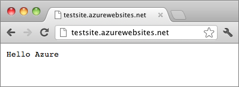

<properties  linkid="develop-node-create-a-website-mac" urlDisplayName="Web site" pageTitle="Create a Node.js web site on Mac - Azure tutorials" metaKeywords="Azure create website Node, Azure deploy website Node, website Node.js, Node website" description="Learn how to build and deploy a Node.js web site in Azure. Sample code is written in Java." metaCanonical="" services="web-sites" documentationCenter="Node.js" title="Build and deploy a Node.js web site to Azure" authors="" solutions="" manager="" editor="" />

# Node.js 웹 사이트 빌드 및 Azure에 배포

이 자습서에서는 [Node] 응용 프로그램을 만들고 [Git]를 사용하여 Azure 웹 사이트에 배포하는 방법을 설명합니다. 이 자습서의 지침은 Node를 실행할 수 있는 모든 운영 체제에 적용될 수 있습니다.

비디오 시청을 선호하는 경우 이 자습서와 동일한 단계를 따르는 오른쪽의 클립을 참조하십시오.

아래에는 완성된 응용 프로그램의 스크린샷이 표시되어 있습니다.

## Azure 웹 사이트 만들기 및 Git 게시 사용

다음 단계에 따라 Azure 웹 사이트를 만들고 해당 웹 사이트에 대해 Git 게시를 사용하도록 설정하십시오.

 

<strong>참고</strong>

이 자습서를 완료하려면 Azure 계정이 필요합니다. 계정이 없는 경우 몇 분 만에 무료 평가판 계정을 만들 수 있습니다. 자세한 내용은 <a href="http://www.windowsazure.com/en-us/pricing/free-trial/?WT.mc_id=A7171371E" target="_blank">Azure 무료 평가판</a>을 참조하십시오.

 1.  [Azure 관리 포털][1]에 로그인합니다.

2.  포털의 왼쪽 아래에서 **+ 새로 만들기** 아이콘을 클릭합니다.
    
    

3.  **웹 사이트**를 클릭한 후 **빠른 생성**을 클릭합니다. **URL**에 값을 입력하고 **지역** 드롭다운에서 웹 사이트의 데이터 센터를 선택합니다. 대화 상자 맨 아래에 있는 확인 표시를 클릭합니다.
    
    

4.  웹 사이트 상태가 **실행**으로 변경되면 웹 사이트의 이름을 클릭하여 **대시보드**에 액세스합니다.
    
    

5.  빠른 시작 페이지의 오른쪽 아래에서 **Set up a deployment from source control**을 선택합니다.
    
    

6.  "소스 코드 위치?" 질문이 나타나면 **Local Git repository**를 선택한 후 화살표를 클릭합니다.
    
    

7.  Git 게시를 사용하도록 설정하려면 사용자 이름 및 암호를 지정해야 합니다. Azure 웹 사이트에 대해 이전에 게시를 사용하도록 설정한 경우 사용자 이름 또는 암호를 묻는 메시지가 표시되지 않습니다. 대신, 이전에 지정한 사용자 이름과 암호를 사용하여 Git 리포지토리가 만들어집니다. 사용자 이름과 암호를 기록해 두십시오. 만드는 모든 Azure 웹 사이트의 Git 게시에 이 사용자 이름과 암호가 사용되기 때문입니다.
    
    

8.  Git 리포지토리가 준비되면 로컬 리포지토리를 설정하고 파일을 Azure에 푸시하는 데 사용할 수 있는 Git 명령 관련 지침이 제공됩니다.
    
    

## 로컬에서 응용 프로그램 빌드 및 테스트

이 섹션에서는 [nodejs.org]의 'hello world' 예가 포함된 **server.js** 파일을 만들겠습니다.
이 예는 원본 예에서 수정된 것으로, Azure 웹 사이트에서 실행되는 경우의 수신 포트로 process.env.PORT가 추가되었습니다.

1.  텍스트 편집기를 사용하여 **server.js**라는 새 파일을 **helloworld** 디렉터리에 만듭니다.
    **helloworld** 디렉터리가 없으면 디렉터리를 만듭니다.
2.  다음을 **server.js** 파일의 내용으로 추가하고 저장합니다.
    
         var http = require('http')
         var port = process.env.PORT || 1337;
         http.createServer(function(req, res) {
           res.writeHead(200, { 'Content-Type': 'text/plain' });
           res.end('Hello World\n');
         }).listen(port);

3.  명령줄을 열고 다음 명령을 사용하여 웹 페이지를 로컬에서 시작합니다.
    
         node server.js
    
    [WACOM.INCLUDE
    [install-dev-tools](../includes/install-dev-tools.md)]

4.  웹 브라우저를 열고 http://localhost:1337로 이동합니다. 아래 스크린샷에 표시된 것처럼 "Hello World"가 표시된 웹 페이지가 나타납니다.
    
    

## 응용 프로그램 게시

1.  명령줄에서 **helloworld** 디렉터리로 이동한 후 다음 명령을 입력하여 로컬 Git 리포지토리를 초기화합니다.
    
         git init
    

**Git 명령을 사용할 수 없는 경우**
[Git][2]은 Azure 웹 사이트를 배포하는 데 사용할 수 있는 분산된 버전 제어 시스템입니다. 플랫폼별 설치 지침은 [Git 다운로드 페이지][3](영문)를 참조하십시오.

2.  다음 명령을 사용하여 리포지토리에 파일을 추가합니다.
    
         git add .
         git commit -m "initial commit"

3.  다음 명령을 사용하여 이전에 만든 Azure 웹 사이트로 업데이트를 푸시하는 Git remote를 추가합니다.
    
         git remote add azure [URL for remote repository]
    
    

4.  다음 명령을 사용하여 변경 내용을 Azure에 푸시합니다.
    
         git push azure master
    
    이전에 만든 암호를 입력하라는 메시지가 나타난 후 다음 출력이 표시됩니다.
    
         Password for 'testsite.scm.azurewebsites.net':
         Counting objects: 3, done.
         Delta compression using up to 8 threads.
         Compressing objects: 100% (2/2), done.
         Writing objects: 100% (3/3), 374 bytes, done.
         Total 3 (delta 0), reused 0 (delta 0)
         remote: New deployment received.
         remote: Updating branch 'master'.
         remote: Preparing deployment for commit id '5ebbe250c9'.
         remote: Preparing files for deployment.
         remote: Deploying Web.config to enable Node.js activation.
         remote: Deployment successful.
         To https://user@testsite.scm.azurewebsites.net/testsite.git
          * [new branch]      master -> master
    
    관리 포털 내에서 Azure 웹 사이트의 배포 탭으로 이동하면 배포 기록에서 첫 번째 배포를 볼 수 있습니다.
    
    

5.  관리 포털 내에서 Azure 웹 사이트 페이지의 **찾아보기** 단추를 사용하여 사이트를 탐색합니다.

## 응용 프로그램에 변경 내용 게시

1.  텍스트 편집기에서 **server.js** 파일을 열고 'Hello World\\n'를 'Hello
    Azure\\n'로 변경합니다. 파일을 저장합니다.
2.  명령줄에서 **helloworld** 디렉터리로 이동한 후 다음 명령을 실행합니다.
    
         git add .
         git commit -m "changing to hello azure"
         git push azure master
    
    이전에 만든 암호를 입력하라는 메시지가 나타납니다. 관리 포털 내에서 Azure 웹 사이트의 배포 탭으로 이동하면 업데이트된 배포 기록을 볼 수 있습니다.
    
    

3.  **찾아보기** 단추를 사용하여 사이트로 이동한 후 업데이트가 적용되었는지 확인합니다.
    
    

4.  관리 포털 내에 있는 Azure 웹 사이트의 "배포" 탭에서 이전 배포를 선택하고 **다시 배포** 단추를 선택하여 이전
    배포로 되돌릴 수 있습니다.

## 다음 단계

이 문서의 단계에 따라 Azure 포털을 사용하여 웹 사이트를 만들 수 있지만 [Mac 및 Linux용 Azure 명령줄 도구](/en-us/develop/nodejs/how-to-guides/command-line-tools/)를 사용하여 동일한 작업을 수행할 수도 있습니다.

Node.js는 응용 프로그램에 사용될 수 있는 풍부한 모듈 에코시스템을 제공합니다. Azure 웹 사이트에서 모듈을 사용하는 방법에 대한 자세한 내용은 [Azure 응용 프로그램에 Node.js 모듈 사용][4](영문)을 참조하십시오.

Azure에 제공되는 Node.js 버전에 대한 정보 및 응용 프로그램에 사용할 버전 지정 방법에 대한 자세한 내용은 [Azure 응용 프로그램에서 Node.js 버전 지정][5](영문)을 참조하십시오.

응용 프로그램을 Azure에 배포한 후 문제가 발생하는 경우 [Azure 웹 사이트에서 Node.js 응용 프로그램 디버그 방법][6](영문)에서 문제를 진단하는 방법에 대한 정보를 참조하십시오.

## 추가 리소스

* [Azure PowerShell](/en-us/develop/nodejs/how-to-guides/powershell-cmdlets/)
* [Mac 및 Linux용 Azure 명령줄 도구](/en-us/develop/nodejs/how-to-guides/command-line-tools/)

[1]: http://manage.windowsazure.com
[2]: http://git-scm.com/
[3]: http://git-scm.com/download
[4]: http://www.windowsazure.com/en-us/develop/nodejs/common-tasks/working-with-node-modules/
[5]: http://www.windowsazure.com/en-us/develop/nodejs/common-tasks/specifying-a-node-version/
[6]: http://www.windowsazure.com/en-us/develop/nodejs/how-to-guides/Debug-Website/