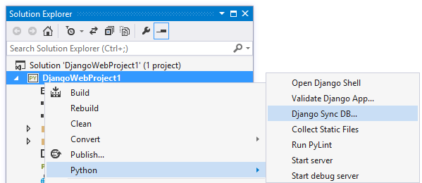

<properties 
	pageTitle="Python Tools 2.1 for Visual Studio가 있는 Azure의 Django 및 SQL 데이터베이스" 
	description="Python Tools for Visual Studio를 사용하여 SQL 데이터베이스 인스턴스에 데이터를 저장하고 웹 사이트에 배포할 수 있는 Django 응용 프로그램을 만드는 방법에 대해 알아봅니다. 
	services="" 
	documentationCenter="python" 
	authors="huguesv" 
	manager="wpickett" 
	editor=""/>

<tags 
	ms.service="web-sites" 
	ms.workload="web" 
	ms.tgt_pltfrm="na" 
	ms.devlang="python" 
	ms.topic="article" 
	ms.date="10/10/2014" 
	ms.author="huvalo"/>

# Python Tools 2.1 for Visual Studio가 있는 Azure의 Django 및 SQL 데이터베이스 

이 자습서에서는 PTVS 샘플 템플릿 중 하나를 사용하여 간단한 설문 조사 응용 프로그램을 만들어 보겠습니다. 이 자습서는 [비디오](https://www.youtube.com/watch?v=ZwcoGcIeHF4)로도 제공됩니다.

Azure에서 호스트된 SQL 데이터베이스를 사용하는 방법, SQL 데이터베이스를 사용하도록 응용 프로그램을 구성하는 방법 및 Azure 웹 사이트에 응용 프로그램을 게시하는 방법을 알아봅니다.

Bottle, Flask 및 Django 웹 프레임워크, MongoDB, Azure 테이블 저장소, MySQL 및 SQL 데이터베이스 서비스를 사용하여 PTVS로 Azure 웹 사이트를 개발하는 내용을 다루는 추가 문서에 대해서는 [Python 개발자 센터][]를 참조하세요.  이 문서는 Azure 웹 사이트를 중점적으로 다루지만 포함된 단계는 [Azure 클라우드 서비스][]를 개발할 때와 비슷합니다.

+ [필수 조건](#prerequisites)
+ [프로젝트 만들기](#create-the-project)
+ [SQL 데이터베이스 만들기](#create-a-sql-database)
+ [프로젝트 구성](#configure-the-project)
+ [Azure 웹 사이트에 게시](#publish-to-an-azure-website)
+ [다음 단계](#next-steps)

##필수 조건

 - Visual Studio 2012 또는 2013
 - [Python Tools 2.1 for Visual Studio][]
 - [Python Tools 2.1 for Visual Studio 샘플 VSIX][]
 - [Azure SDK Tools for VS 2013][] 또는 [Azure SDK Tools for VS 2012][]
 - [Python 2.7 32비트][]

[AZURE.INCLUDE [create-account-and-websites-note](../includes/create-account-and-websites-note.md)]

##프로젝트 만들기

이 섹션에서는 샘플 템플릿을 사용하여 Visual Studio 프로젝트를 만듭니다. 가상 환경을 만들고 필요한 패키지를 설치합니다.  sqlite를 사용하여 로컬 데이터베이스를 만듭니다.  그런 후 응용 프로그램을 로컬로 실행합니다.

1.  Visual Studio에서 **파일**, **새 프로젝트**를 선택합니다.

1.  PTVS 샘플 VSIX의 프로젝트 테플릿은 **Python**, **샘플**에서 사용할 수 있습니다.  **Polls Django Web Project**를 선택하고 확인을 클릭하여 프로젝트를 만듭니다.

  	

1.  외부 패키지를 설치할지 묻는 메시지가 표시됩니다.  **가상 환경에 설치**를 선택합니다.

  	

1.  기본 해석기로 **Python 2.7**을 선택합니다.

  	

1.  프로젝트 노드를 마우스 오른쪽 단추로 클릭하고 **Python**, **Django Sync DB**를 선택합니다.

  	

1.  이렇게 하면 Django Management Console이 열립니다.  프롬프트에 따라 사용자를 만듭니다.

    그러면 프로젝트 폴더에 sqlite 데이터베이스가 만들어집니다.

  	

1.  <kbd>F5</kbd> 키를 눌러 응용 프로그램이 작동하는지 확인합니다.

1.  위쪽의 탐색 모음에서 **로그인**을 클릭합니다.

  	

1.  데이터베이스를 동기화할 때 만든 사용자의 자격 증명을 입력합니다.

  	

1.  **Create Sample Polls**를 클릭합니다.

  	

1.  poll and vote를 클릭합니다.

  	

##SQL 데이터베이스 만들기

데이터베이스로. Azure SQL 데이터베이스를 만듭니다.

다음 단계에 따라 데이터베이스를 만들 수 있습니다.

1.  [Azure 관리 포털][]에 로그인합니다.

1.  탐색 창 맨 아래에 있는 **새로 만들기**를 클릭합니다.

  	

1.  **데이터 서비스**, **SQL 데이터베이스**, **빠른 생성**을 차례로 클릭합니다.

  	

1.  새 SQL 데이터베이스 서버를 만들도록 선택합니다.

1.  데이터베이스를 찾을 영역/선호도 그룹을 선택합니다. Azure 응용 프로그램에서 데이터베이스를 사용하는 경우 응용 프로그램을 배포할 영역과 동일한 영역을 선택합니다.

##프로젝트 구성

이 섹션에서는 방금 만든 SQL 데이터베이스를 사용하도록 응용 프로그램을 구성합니다.  Azure 포털에서 연결 설정을 가져오는 방법을 알아봅니다.  Django에서 SQL 데이터베이스를 사용하는 데 필요한 추가 Python 패키지도 설치합니다.  그런 후 응용 프로그램을 로컬로 실행합니다.

1.  [Azure 관리 포털][]에서 **SQL 데이터베이스**를 클릭하고 이전에 만든 데이터베이스를 클릭합니다.

1.  **관리**를 클릭합니다.

  	

1.  방화벽 규칙을 업데이트하라는 메시지가 표시됩니다. **예**를 클릭합니다.  개발 컴퓨터에서 데이터베이스 서버에 연결할 수 있게 됩니다.

  	

1.  **SQL 데이터베이스**를 클릭하고 **서버**를 클릭합니다.  데이터베이스에 대한 서버를 클릭하고 **구성**을 클릭합니다.

1.  이 페이지에는 데이터베이스 서버에 연결하도록 허용된 모든 컴퓨터의 IP 주소가 표시됩니다.  컴퓨터의 IP 주소가 표시됩니다.

    아래의 **허용된 서비스**에서 Azure 서비스의 서버 액세스가 허용되는지 확인합니다.  응용 프로그램이 Azure 웹 사이트에서 실행되고 있으면(이 자습서의 다음 섹션에서 이 작업을 수행함) 데이터베이스에 연결하도록 허용됩니다.  **저장**을 클릭하여 변경 내용을 적용합니다.

  	

1.  Visual Studio에서  *ProjectName* 폴더의 **settings.py**를 엽니다.  `DATABASES`의 정의를 편집합니다.

        DATABASES = {
            'default': {
                'ENGINE': 'sql_server.pyodbc',
                'NAME': '<DatabaseName>',
                'USER': '<User>@<ServerName>',
                'PASSWORD': '<Password>',
                'HOST': '<ServerName>.database.windows.net',
                'PORT': '<ServerPort>',
                'OPTIONS': {
                    'driver': 'SQL Server Native Client 11.0',
                    'MARS_Connection': 'True',
                }
            }
        }

    `<DatabaseName>`, `<User>` 및 `<Password>`는 데이터베이스와 서버를 만들 때 지정한 값입니다.

    서버가 만들어질 때 `<ServerName>` 및 `<ServerPort>`의 값이 Azure에서 생성되며 **데이터베이스에 연결** 섹션에서 찾을 수 있습니다.

1.  솔루션 탐색기의 **Python Environments**에서 가상 환경을 마우스 오른쪽 단추로 클릭하고 **Install Python Package**를 선택합니다.

1.  **easy_install**을 사용하여 패키지  `pyodbc`를 설치합니다.

  	

1.  **easy_install**을 사용하여 패키지  `django-pyodbc-azure`를 설치합니다.

  	

1.  프로젝트 노드를 마우스 오른쪽 단추로 클릭하고 **Python**, **Django Sync DB**를 선택합니다.  

    이렇게 하면 이전 섹션에서 만든 SQL 데이터베이스에 대한 테이블이 만들어집니다.  프롬프트에 따라 사용자를 만듭니다. 이 사용자가 첫 번째 섹션에서 만든 sqlite 데이터베이스의 사용자와 일치할 필요는 없습니다.

  	

1.  <kbd>F5</kbd> 키를 눌러 응용 프로그램을 실행합니다.  **Create Sample Polls**를 사용하여 만든 설문 조사와 투표를 통해 제출된 데이터는 SQL 데이터베이스에서 serialize됩니다.

##Azure 웹 사이트에 게시

PTVS는 Azure 웹 사이트에 웹 응용 프로그램을 배포하는 쉬운 방법을 제공합니다.

1.  **솔루션 탐색기**에서 프로젝트 노드를 마우스 오른쪽 단추로 클릭하고 **게시**를 선택합니다.

  	

1.  **Microsoft Azure 웹 사이트**를 클릭합니다.

1.  **새로 만들기**를 클릭하여 새 사이트를 만듭니다.

1.  **사이트 이름** 및 **지역**을 선택하고 **만들기**를 클릭합니다.

  	

1.  다른 모든 기본값을 그대로 적용하고 **게시**를 클릭합니다.

1.  웹 브라우저가 자동으로 게시된 사이트로 열립니다.  Azure에 호스트된 **SQL** 데이터베이스를 사용하여 예상한 대로 응용 프로그램이 작동하는지 확인합니다.

    축하합니다.

  	

##다음 단계

Python Tools for Visual Studio, Django and SQL 및 SQL 데이터베이스에 대해 자세히 알아보려면 다음 링크를 참조하세요.

- [Python Tools for Visual Studio 설명서][]
  - [웹 프로젝트][]
  - [클라우드 서비스 프로젝트][]
  - [Microsoft Azure의 원격 디버깅][]
- [Django 설명서][]
- [SQL 데이터베이스][]

<!--Link references-->
[Python 개발자 센터]: /ko-kr/develop/python/
[Azure 클라우드 서비스]: ../cloud-services-python-ptvs/

<!--External Link references-->
[Azure 관리 포털]: https://manage.windowsazure.com
[Python Tools 2.1 for Visual Studio]: http://go.microsoft.com/fwlink/?LinkId=517189
[Python Tools 2.1 for Visual Studio 샘플 VSIX]: http://go.microsoft.com/fwlink/?LinkId=517189
[Azure SDK Tools for VS 2013]: http://go.microsoft.com/fwlink/?LinkId=323510
[Azure SDK Tools for VS 2012]: http://go.microsoft.com/fwlink/?LinkId=323511
[Python 2.7 32비트]: http://go.microsoft.com/fwlink/?LinkId=517190 
[Python Tools for Visual Studio 설명서]: http://pytools.codeplex.com/documentation
[Microsoft Azure의 원격 디버깅]: http://pytools.codeplex.com/wikipage?title=Features%20Azure%20Remote%20Debugging
[웹 프로젝트]: http://pytools.codeplex.com/wikipage?title=Features%20Web%20Project
[클라우드 서비스 프로젝트]: http://pytools.codeplex.com/wikipage?title=Features%20Cloud%20Project
[Django 설명서]: https://www.djangoproject.com/
[SQL 데이터베이스]: /ko-kr/documentation/services/sql-database/

<!--HONumber=42-->
