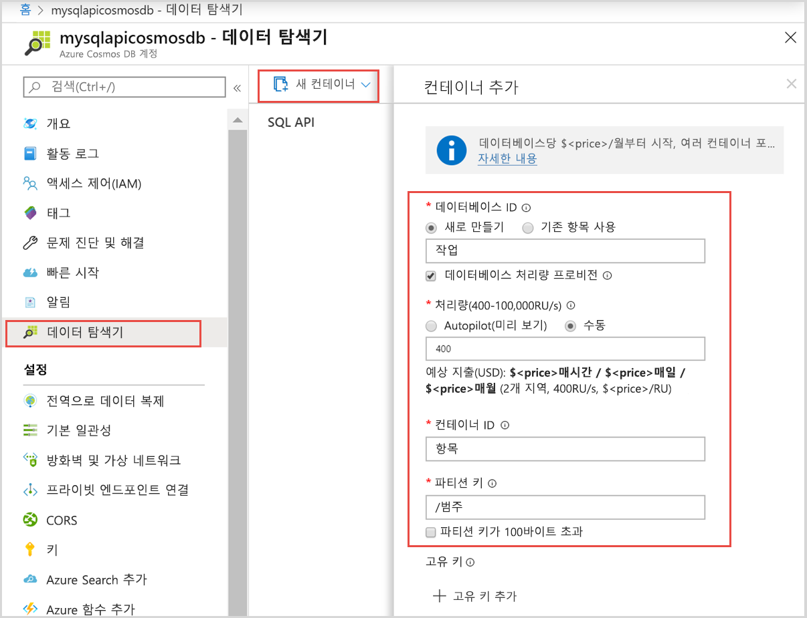

이제 Azure Portal에서 데이터 탐색기 도구를 사용하여 데이터베이스 및 컬렉션을 만들 수 있습니다. 

1. **데이터 탐색기** > **새 컬렉션**을 클릭합니다. 
    
    **컬렉션 추가** 영역이 맨 오른쪽에 표시되면 확인하기 위해 오른쪽으로 스크롤해야 합니다.

    

2. **컬렉션 추가** 페이지에서 새 컬렉션에 대한 설정을 입력합니다.

    설정|제안 값|설명
    ---|---|---
    데이터베이스 ID|작업|새 데이터베이스의 이름으로 *작업*을 입력합니다. 데이터베이스 이름은 1~255자여야 하며, `/, \\, #, ?` 또는 후행 공백은 포함할 수 없습니다.
    컬렉션 ID|항목|새 컬렉션의 이름으로 *항목*을 입력입니다. 컬렉션 ID에는 데이터베이스 이름과 동일한 문자 요구 사항이 적용됩니다.
    파티션 키| <Your partition key>| */userid*와 같은 파티션 키를 입력합니다.
    처리량|400RU|처리량을 400RU/s(초당 요청 단위)로 변경합니다. 대기 시간을 줄이면 나중에 처리량을 늘릴 수 있습니다. 
    
    앞의 설정 외에도 선택적으로 컬렉션에 대한 **고유 키**를 추가할 수 있습니다. 이 예에서 필드는 비워 두겠습니다. 고유 키는 데이터베이스에 데이터 무결성 계층을 추가할 수 있는 기능을 개발자에게 제공합니다. 컬렉션을 만드는 동안 고유 키 정책을 만들면 파티션 키당 하나 이상의 값에 대한 고유성이 보장됩니다. 자세한 내용은 [Azure Cosmos DB의 고유 키](../articles/cosmos-db/unique-keys.md) 문서를 참조하세요.
    
    **확인**을 클릭합니다.

    데이터 탐색기는 새 데이터베이스 및 컬렉션을 표시합니다.

    