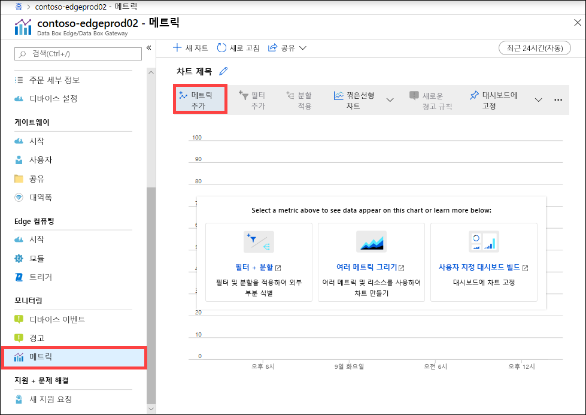
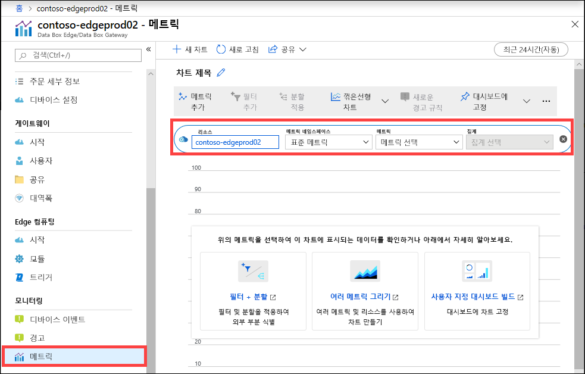
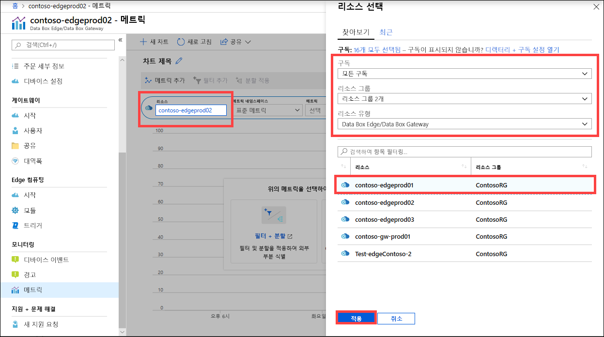
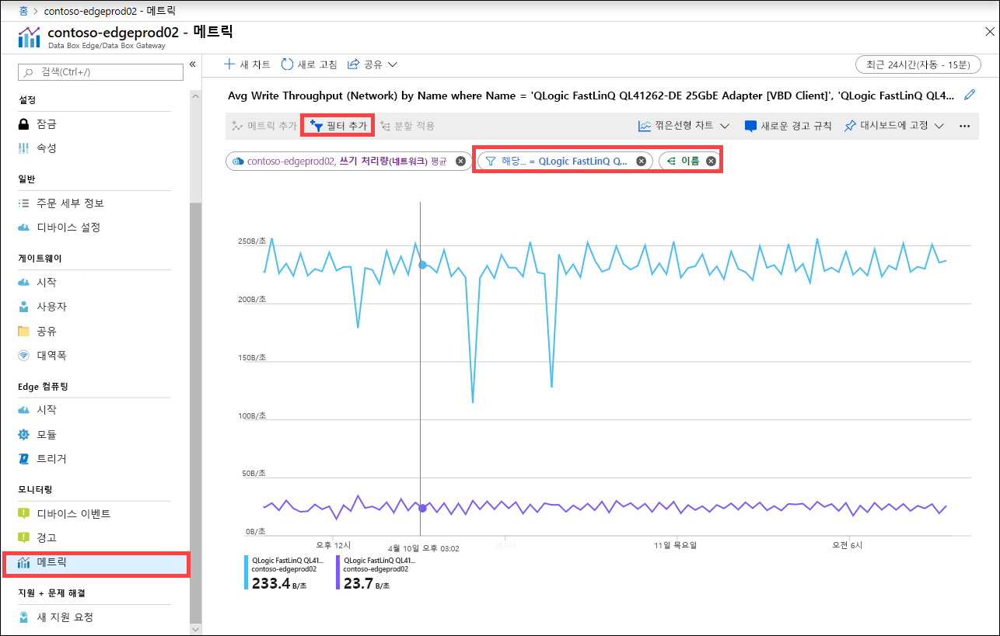

디바이스의 성능을 모니터링하거나 일부 인스턴스에서 디바이스 문제를 해결하기 위해 메트릭을 볼 수도 있습니다.

선택한 디바이스 메트릭에 대한 차트를 만들려면 Azure Portal에서 다음 단계를 수행합니다.

1. Azure Portal에 있는 리소스의 경우 **모니터링 > 메트릭** 으로 차례로 이동하여  **메트릭 추가** 를 선택합니다.

    

2. 리소스가 자동으로 채워집니다.  

    

    다른 리소스를 지정하려면 해당 리소스를 선택합니다. **리소스 선택** 블레이드에서 메트릭을 표시하려는 구독, 리소스 그룹, 리소스 종류 및 특정 리소스를 선택하고 **적용** 을 선택합니다.

    

3. 드롭다운 목록에서 디바이스를 모니터링할 메트릭을 선택합니다. 이러한 메트릭의 전체 목록은 [디바이스의 메트릭](#metrics-on-your-device)을 참조하세요.

4. 드롭다운 목록에서 메트릭이 선택되면 집계도 정의할 수 있습니다. 집계는 지정된 기간 동안 집계된 실제 값을 나타냅니다. 집계된 값은 평균, 최솟값 또는 최댓값이 될 수 있습니다. 평균, 최대 또는 최소에서 집계를 선택합니다.

    

5. 선택한 메트릭에 여러 인스턴스가 있으면 분할 옵션을 사용할 수 있습니다. **분할 적용** 을 선택한 다음, 분석 결과를 확인하려는 값을 선택합니다.

    

6. 몇 가지 인스턴스에 대한 분석 결과만 확인하려면 이제 데이터를 필터링할 수 있습니다. 예를 들어 이 경우 디바이스에 연결된 두 개의 네트워크 인터페이스에 대한 네트워크 처리량만 확인하려면 이러한 인터페이스를 필터링할 수 있습니다. **필터 추가** 를 선택하고, 필터링할 네트워크 인터페이스 이름을 지정합니다.

    

7. 차트를 대시보드에 고정하여 쉽게 액세스할 수도 있습니다.

    

8. 차트 데이터를 Excel 스프레드시트로 내보내거나 공유할 수 있는 차트에 대한 링크를 가져오려면 명령 모음에서 공유 옵션을 선택합니다.

    
