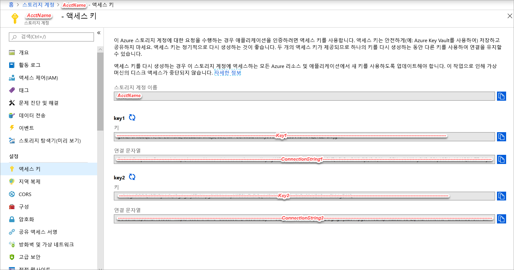

## <a name="prerequisites"></a>필수 조건

### <a name="azure-subscription"></a>Azure 구독
Azure 구독이 아직 없는 경우 시작하기 전에 [체험 계정](https://azure.microsoft.com/free/)을 만듭니다.

### <a name="azure-roles"></a>Azure 역할
데이터 팩터리 인스턴스를 만들려면 Azure에 로그인하는 데 사용할 사용자 계정이 *참여자* 또는 *소유자* 역할의 구성원이거나, Azure 구독의 *관리자*여야 합니다. 구독에 있는 권한을 보려면 Azure Portal에서 오른쪽 위 모서리에 있는 사용자 이름을 선택한 다음, **권한**을 선택합니다. 여러 구독에 액세스할 수 있는 경우 적절한 구독을 선택합니다. 

데이터 세트, 연결된 서비스, 파이프라인, 트리거 및 통합 런타임을 포함하여 Data Factory에 대한 자식 리소스를 만들고 관리하려면 다음 요구 사항을 적용해야 합니다.
- Azure Portal에서 자식 리소스를 만들고 관리하려면 리소스 그룹 수준 이상의 **Data Factory 기여자** 역할에 속해야 합니다.
- PowerShell 또는 SDK를 사용하여 자식 리소스를 만들고 관리하려면 리소스 수준 이상의 **기여자** 역할만으로도 충분합니다.

사용자를 역할에 추가하는 방법에 대한 지침 샘플은 [역할 추가](../articles/billing/billing-add-change-azure-subscription-administrator.md) 문서를 참조하세요.

자세한 내용은 다음 문서를 참조하세요.
- [Data Factory 기여자 역할](../articles/role-based-access-control/built-in-roles.md#data-factory-contributor)
- [Azure Data Factory에 대한 역할 및 권한](../articles/data-factory/concepts-roles-permissions.md)

### <a name="azure-storage-account"></a>Azure Storage 계정
이 빠른 시작에서는 범용 Azure 저장소 계정(특히 Blob 저장소)을 *원본* 및 *대상* 데이터 저장소로 사용합니다. 범용 Azure 저장소 계정이 없는 경우 [저장소 계정 만들기](../articles/storage/common/storage-quickstart-create-account.md)를 참조하여 새로 만듭니다. 

#### <a name="get-the-storage-account-name-and-account-key"></a>저장소 계정 이름 및 계정 키 가져오기
이 빠른 시작에서는 Azure 저장소 계정의 이름과 키가 필요합니다. 다음 프로시저에서는 저장소 계정 이름 및 키를 가져오는 단계를 제공합니다. 

1. 웹 브라우저에서 [Azure Portal](https://portal.azure.com)로 이동합니다. Azure 사용자 이름과 암호를 사용하여 로그인합니다. 
2. 왼쪽 메뉴에서 **모든 서비스**를 선택하고, **저장소** 키워드를 사용하여 필터링하고, **저장소 계정**을 선택합니다.

   
3. 저장소 계정 목록에서 저장소 계정(필요한 경우)을 필터링한 다음 저장소 계정을 선택합니다. 
4. **저장소 계정** 페이지의 메뉴에서 **액세스 키**를 선택합니다.

   
5. **저장소 계정 이름** 및 **key1** 상자의 값을 클립보드에 복사합니다. 메모장이나 다른 편집기에 붙여넣고 저장합니다. 이 빠른 시작의 뒷부분에서 사용됩니다.   

#### <a name="create-the-input-folder-and-files"></a>입력 폴더 및 파일 만들기
이 섹션에서는 Azure Blob Storage에 **adftutorial**이라는 Blob 컨테이너를 만듭니다. 컨테이너에 **입력**이라는 폴더를 만든 다음 입력 폴더에 샘플 파일을 업로드합니다. 

1. **저장소 계정** 페이지에서 **개요**로 전환한 다음, **Blob**을 선택합니다. 

   
2. **Blob service** 페이지의 도구 모음에서 **+ 컨테이너**를 선택합니다. 

       
3. **새 컨테이너** 대화 상자에서 **adftutorial**을 이름으로 입력한 다음 **확인**을 선택합니다. 

   
4. 컨테이너 목록에서 **adftutorial**을 선택합니다. 

   
5. **컨테이너** 페이지의 도구 모음에서 **업로드**를 선택합니다.  

   
6. **Blob 업로드** 페이지에서 **고급**을 선택합니다.

   
7. **메모장**을 시작하고 다음 내용을 사용하여 **emp.txt**라는 파일을 만듭니다. **c:\ADFv2QuickStartPSH** 폴더에 저장합니다. 아직 없는 경우 **ADFv2QuickStartPSH** 폴더를 만듭니다.
    
   ```
   John, Doe
   Jane, Doe
   ```    
8. Azure Portal의 **Blob 업로드** 페이지에서 **파일** 상자에 대해 **emp.txt** 파일을 탐색 및 선택합니다. 
9. **입력**을 **폴더로 업로드** 상자 값으로 입력합니다. 

        
10. 폴더는 **입력**이고 파일은 **emp.txt**인지 확인한 후 **업로드**를 선택합니다.
    
    목록에서 **emp.txt** 파일 및 업로드 상태를 참조하세요. 
12. 모서리에 있는 **X**를 클릭하여 **BLOB 업로드** 페이지를 닫습니다. 

    
1. **컨테이너** 페이지를 열린 상태로 유지합니다. 이 빠른 시작의 끝부분에서 출력을 확인하는 데 사용합니다.