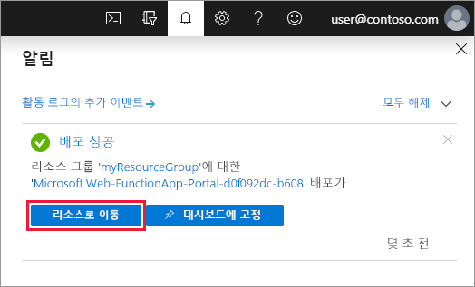

1. Azure Portal 메뉴에서 **리소스 만들기**를 선택합니다.

    

1. **새로 만들기** 페이지에서 **컴퓨팅** > **함수 앱**을 선택합니다.

1. 이미지 아래 표에 지정된 것처럼 함수 앱 설정을 사용합니다.

    

    | 설정      | 제안 값  | Description |
    | ------------ | ---------------- | ----------- |
    | **구독** | 사용자의 구독 | 이 새 함수 앱이 만들어질 구독입니다. |
    | **[리소스 그룹](../articles/azure-resource-manager/management/overview.md)** |  *myResourceGroup* | 함수 앱을 만들 새 리소스 그룹의 이름입니다. |
    | **함수 앱 이름** | 전역적으로 고유한 이름 | 새 함수 앱을 식별하는 이름입니다. 유효한 문자는 `a-z`(대/소문자 구분 안 함), `0-9`및 `-`입니다.  |
    |**게시**| 코드 | 코드 파일 또는 Docker 컨테이너를 게시하는 옵션입니다. |
    | **런타임 스택** | 기본 설정 언어 | 즐겨찾는 함수 프로그래밍 언어를 지원하는 런타임을 선택합니다. C# 및 F# 함수의 경우 **.NET**을 선택합니다. |
    |**지역**| 기본 지역 | 사용자 근처 또는 함수가 액세스할 기타 서비스에 가까운 [지역](https://azure.microsoft.com/regions/)을 선택합니다. |

    **다음: 호스팅 >** 단추를 선택합니다.

1. 호스팅을 위해 다음 설정을 입력합니다.

    

    | 설정      | 제안 값  | Description |
    | ------------ | ---------------- | ----------- |
    | **[Storage 계정](../articles/storage/common/storage-account-create.md)** |  전역적으로 고유한 이름 |  함수 앱에서 사용하는 스토리지 계정을 만듭니다. Storage 계정 이름은 3자에서 24자 사이여야 하고 숫자 및 소문자만 포함할 수 있습니다. 기존 계정을 사용할 수도 있습니다. 여기서는 [스토리지 계정 요구 사항](../articles/azure-functions/functions-scale.md#storage-account-requirements)을 충족해야 합니다. |
    |**운영 체제**| 기본 설정 운영 체제 | 운영 체제는 런타임 스택 선택에 따라 미리 선택되지만 필요한 경우 설정을 변경할 수 있습니다. |
    | **[계획](../articles/azure-functions/functions-scale.md)** | 소비 계획 | 함수 앱에 리소스가 할당되는 방법을 정의하는 호스팅 계획입니다. 기본 **소비 계획**에서 함수의 필요에 따라 리소스가 동적으로 추가됩니다. [서버 없는](https://azure.microsoft.com/overview/serverless-computing/) 호스팅에서는 함수가 실행되는 시간 만큼만 요금을 지불하면 됩니다. App Service 계획에서 실행하는 경우 [함수 앱의 크기 조정](../articles/azure-functions/functions-scale.md)을 관리해야 합니다.  |

    **다음: 모니터링 >** 단추를 선택합니다.

1. 모니터링을 위해 다음 설정을 입력합니다.

    

    | 설정      | 제안 값  | Description |
    | ------------ | ---------------- | ----------- |
    | **[Application Insights](../articles/azure-functions/functions-monitoring.md)** | 기본값 | 가장 가까운 지원 영역에 동일한 *앱 이름*의 Application Insight 리소스를 만듭니다. 이 설정을 확장하면 **새 리소스 이름**을 변경하거나 데이터를 저장하려는 [Azure 지리적 위치](https://azure.microsoft.com/global-infrastructure/geographies/)에서 다른 **위치**를 선택합니다. |

    **검토 + 만들기**를 선택하여 앱 구성 선택을 검토합니다.

1. **만들기**를 선택하여 함수 앱을 프로비전하고 배포합니다.

1. 포털의 오른쪽 위 모서리에 있는 [알림] 아이콘을 선택하고 **배포 성공** 메시지가 표시될 때까지 기다립니다.

    

1. **리소스로 이동**을 선택하여 함수 앱을 봅니다. **대시보드에 고정**을 선택할 수도 있습니다. 고정하면 대시보드에서 이 함수 앱 리소스로 쉽게 돌아올 수 있습니다.
