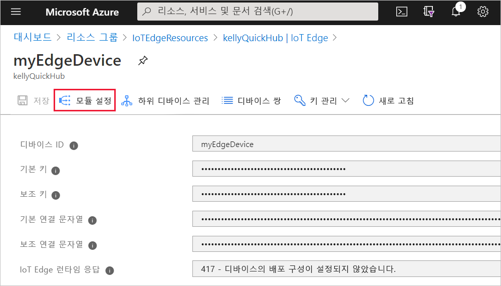
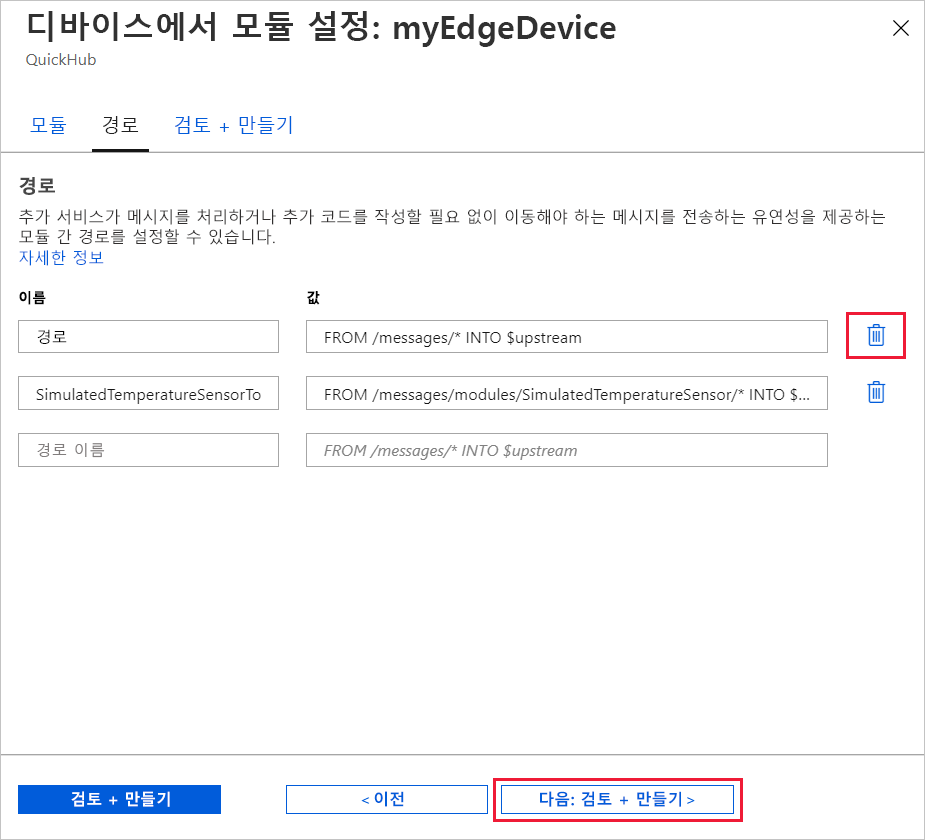

Azure IoT Edge의 주요 기능 중 하나는 클라우드의 IoT Edge 디바이스에 코드를 배포하는 것입니다. *IoT Edge 모듈* 은 컨테이너로 구현된 실행 패키지입니다. 이 섹션에서는 Azure IoT Hub에서 직접 [Azure Marketplace의 IoT Edge 모듈 섹션](https://azuremarketplace.microsoft.com/marketplace/apps/category/internet-of-things?page=1&subcategories=iot-edge-modules)에서 미리 빌드된 모듈을 배포합니다.

이 섹션에서 배포하는 모듈은 센서를 시뮬레이션하고 생성된 데이터를 보냅니다. 이 모듈은 시뮬레이션된 데이터를 개발 및 테스트에 사용할 수 있으므로 IoT Edge를 시작할 때 유용한 코드 조각입니다. [시뮬레이션된 온도 센서 소스 코드](https://github.com/Azure/iotedge/blob/027a509549a248647ed41ca7fe1dc508771c8123/edge-modules/SimulatedTemperatureSensor/src/Program.cs)를 보면 이 모듈이 하는 일을 정확하게 이해할 수 있습니다.

Azure Marketplace에서 첫 번째 모듈을 배포하려면 다음 단계를 수행합니다.

1. [Azure Portal](https://portal.azure.com)에 로그인하고 IoT 허브로 이동합니다.

1. 왼쪽에 있는 메뉴의 **자동 디바이스 관리** 에서 **IoT Edge** 를 선택합니다.

1. 디바이스 목록에서 대상 디바이스의 디바이스 ID를 선택합니다.

1. 위쪽 막대에서 **모듈 설정** 을 선택합니다.

   

1. **IoT Edge 모듈** 에서 **추가** 드롭다운 메뉴를 연 다음, **Marketplace 모듈** 을 선택합니다.

   

1. **IoT Edge Module Marketplace** 에서 `Simulated Temperature Sensor` 모듈을 검색하여 선택합니다.

   모듈이 원하는 **실행 중** 상태인 IoT Edge 모듈 섹션에 추가됩니다.

1. 완료되면 **다음: 경로** 를 선택하여 마법사의 다음 단계를 계속 진행합니다.

   

1. **경로** 탭에서 **route** 라는 기본 경로를 제거한 다음, **다음: 검토 + 만들기** 를 선택하여 마법사의 다음 단계를 계속 진행합니다.

   >[!Note]
   >경로는 이름 및 값 쌍을 사용하여 생성됩니다. 이 페이지에는 두 개의 경로가 표시되어야 합니다. **route** 라는 기본 경로는 모든 메시지를 IoT Hub(`$upstream`이라고 함)로 보냅니다. Azure Marketplace에서 모듈을 추가하면 **SimulatedTemperatureSensorToIoTHub** 라는 두 번째 경로가 자동으로 만들어집니다. 이 경로는 시뮬레이션된 온도 모듈의 모든 메시지를 IoT Hub로 보냅니다. 이 경우 중복되기 때문에 기본 경로를 삭제할 수 있습니다.

   

1. JSON 파일을 검토한 다음, **만들기** 를 선택합니다. JSON 파일은 IoT Edge 디바이스에 배포하는 모든 모듈을 정의합니다. **SimulatedTemperatureSensor** 모듈은 물론 **edgeAgent** 와 **edgeHub** 라는 런타임 모듈 두 개가 표시됩니다.

   >[!Note]
   >IoT Edge 디바이스에 새 배포를 제출할 때는 디바이스에 아무것도 푸시되지 않습니다. 대신 디바이스가 IoT Hub에 새로운 지침이 있는지를 정기적으로 쿼리합니다. 디바이스는 업데이트된 배포 매니페스트를 찾으면 새 배포에 대한 정보를 사용하여 클라우드에서 모듈 이미지를 끌어온 다음, 모듈을 로컬로 실행하기 시작합니다. 이 프로세스는 몇 분 정도 걸릴 수 있습니다.

1. 모듈 배포 세부 정보를 만들면 마법사는 디바이스 세부 정보 페이지로 돌아갑니다. **모듈** 탭에서 배포 상태를 확인합니다.

   세 가지 모듈 즉, **$edgeAgent**, **$edgeHub** 및 **SimulatedTemperatureSensor** 가 나열됩니다. 하나 이상의 모듈에서 **디바이스에서 보고됨** 이 아닌 **배포에 지정됨** 이 **예** 인 경우, 사용자의 IoT Edge 디바이스는 계속 시작되고 있습니다. 몇 분 기다렸다가 페이지를 새로 고칩니다.

   
