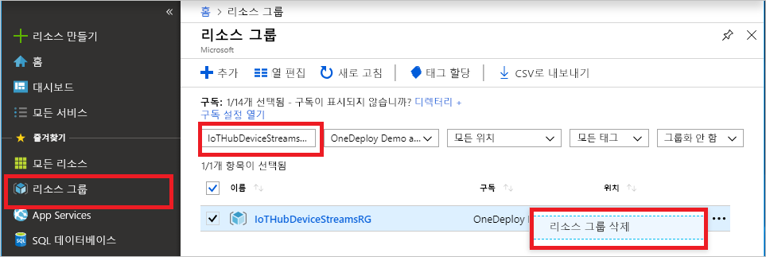

그 다음 권장되는 문서를 계속 진행할 계획이라면 지금까지 만든 리소스를 그대로 두고 재사용할 수 있습니다.

더 이상 진행할 생각이 없으면 요금이 발생하지 않도록 이 문서에서 만든 Azure 리소스를 삭제해도 됩니다.

> [!IMPORTANT]
> 리소스 그룹을 삭제하면 다시 되돌릴 수 없습니다. 리소스 그룹 및 그 안에 포함된 모든 리소스가 영구적으로 삭제됩니다. 잘못된 리소스 그룹 또는 리소스를 자동으로 삭제하지 않도록 해야 합니다. 보관하려는 리소스가 들어 있는 기존 리소스 그룹 내에 IoT Hub를 만든 경우 리소스 그룹이 아닌 IoT Hub 리소스만 삭제해야 합니다.
>

리소스 그룹을 이름으로 삭제하려면:

1. [Azure Portal](https://portal.azure.com)에 로그인한 다음, **리소스 그룹**을 선택합니다.

1. **이름을 기준으로 필터링** 상자에 IoT Hub가 들어 있는 리소스 그룹의 이름을 입력합니다.

1. 결과 목록에서 리소스 그룹의 오른쪽에 있는 줄임표( **...** )를 선택한 다음, **리소스 그룹 삭제**를 선택합니다.

    

1. 리소스 그룹 이름을 다시 입력한 다음, **삭제**를 선택하여 리소스 그룹 삭제를 확인합니다. 몇 분 후 리소스 그룹과 그 안에 들어 있는 모든 리소스가 삭제됩니다.
