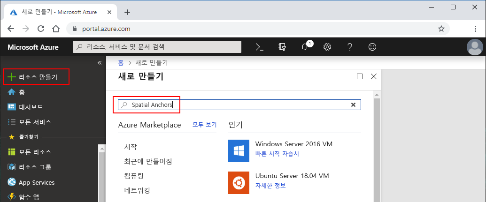
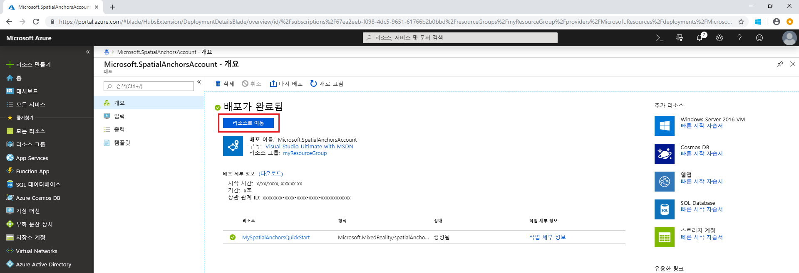

## <a name="create-a-spatial-anchors-resource"></a>Spatial Anchors 리소스 만들기

### <a name="portal"></a>[포털](#tab/azure-portal)

<a href="https://portal.azure.com" target="_blank">Azure 포털</a>로 이동합니다.

왼쪽 창에서 **리소스 만들기** 를 선택합니다.

검색 상자를 사용하여 **Spatial Anchors** 를 검색합니다.



**Spatial Anchors** 를 선택한 다음, **만들기** 를 선택합니다.

**Spatial Anchors 계정** 창에서 다음을 수행합니다.

* 일반 영숫자 문자를 사용하여 고유한 리소스 이름을 입력합니다.  
* 리소스를 연결할 구독을 선택합니다.  
* **새로 만들기** 를 선택하여 리소스 그룹을 만듭니다. 이름을 **myResourceGroup** 으로 지정한 다음, **확인** 을 선택합니다.  

  [!INCLUDE [resource group intro text](resource-group.md)]
  
* 리소스를 배치할 위치(Azure 지역)를 선택합니다.  
* **새로 만들기** 를 선택하여 리소스 만들기를 시작합니다.


리소스를 만든 후 Azure Portal은 배포가 완료되었음을 표시합니다. 
   


**리소스로 이동** 을 선택합니다. 이제 리소스 속성을 볼 수 있습니다. 
   
나중에 사용하기 위해 리소스의 **계정 ID** 값을 텍스트 편집기에 복사합니다.


또한 리소스의 **계정 도메인** 값을 텍스트 편집기에 복사합니다.


**설정** 아래에서 **키** 를 선택합니다. 나중에 사용하기 위해 **기본 키** 값, **계정 키** 를 텍스트 편집기에 복사합니다.


### <a name="azure-cli"></a>[Azure CLI](#tab/azure-cli)

Azure CLI에 대한 환경 준비하는 것으로 시작합니다.

[!INCLUDE [azure-cli-prepare-your-environment-no-header.md](azure-cli-prepare-your-environment-no-header.md)]

1. 로그인 후 [az account set](/cli/azure/account#az_account_set) 명령을 사용하여 공간 앵커 계정을 설정할 구독을 선택합니다.

   ```azurecli
   az account set --subscription 00000000-0000-0000-0000-000000000000
   ```

1. [az group create](/cli/azure/group#az_group_create) 명령을 실행하여 리소스 그룹을 만들거나 기존 리소스 그룹을 사용합니다.

   ```azurecli
   az group create --name myResourceGroup --location eastus2
   ```

   [!INCLUDE [resource group intro text](resource-group.md)]

   [az spatial-anchors-account list](/cli/azure/ext/mixed-reality/spatial-anchors-account#ext_mixed_reality_az_spatial_anchors_account_list) 명령을 사용하여 리소스 그룹의 현재 공간 앵커 계정을 볼 수 있습니다.

   ```azurecli
   az spatial-anchors-account list --resource-group myResourceGroup
   ```

   또한 구독의 공간 앵커 계정을 볼 수도 있습니다.

   ```azurecli
   az spatial-anchors-account list
   ```

1. [az spatial-anchors-account create](/cli/azure/ext/mixed-reality/spatial-anchors-account#ext_mixed_reality_az_spatial_anchors_account_create) 명령을 실행하여 공간 앵커 계정을 만듭니다.

   ```azurecli
   az spatial-anchors-account create --resource-group myResourceGroup --name MySpatialAnchorsQuickStart --location eastus2
   ```

1. [az spatial-anchors-account show](/cli/azure/ext/mixed-reality/spatial-anchors-account#ext_mixed_reality_az_spatial_anchors_account_show) 명령을 사용하여 리소스 속성을 봅니다.

   ```azurecli
   az spatial-anchors-account show --resource-group myResourceGroup --name MySpatialAnchorsQuickStart
   ```

   나중에 사용하기 위해 리소스 **계정 ID** 값과 리소스 **계정 도메인** 값을 텍스트 편집기에 복사합니다.

1. [az spatial-anchors-account key show](/cli/azure/ext/mixed-reality/spatial-anchors-account/key#ext_mixed_reality_az_spatial_anchors_account_key_show) 명령을 실행하여 기본 키 및 보조 키를 가져옵니다.

   ```azurecli
   az spatial-anchors-account key show --resource-group myResourceGroup --name MySpatialAnchorsQuickStart
   ```

   나중에 사용하기 위해 키 값을 텍스트 편집기에 복사합니다.

   키를 다시 생성해야 하는 경우 [az spatial-anchors-account key renew](/cli/azure/ext/mixed-reality/spatial-anchors-account/key#ext_mixed_reality_az_spatial_anchors_account_key_renew) 명령을 사용합니다.

   ```azurecli
   az spatial-anchors-account key renew --resource-group myResourceGroup --name example --key primary
   az spatial-anchors-account key renew --resource-group myResourceGroup --name example --key secondary
   ```

[az spatial-anchors-account delete](/cli/azure/ext/mixed-reality/spatial-anchors-account#ext_mixed_reality_az_spatial_anchors_account_delete) 명령을 사용하여 계정을 삭제할 수 있습니다.

```azurecli
az spatial-anchors-account delete --resource-group myResourceGroup --name MySpatialAnchorsQuickStart
```

---
