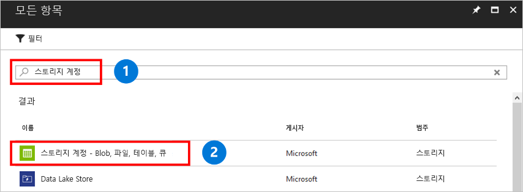

스토리지 계정은 Azure 파일 공유 또는 Blob나 큐와 같은 다른 스토리지 리소스를 배포할 수 있는 스토리지의 공유 풀입니다. 스토리지 계정에 포함될 수 있는 공유 수에는 제한이 없습니다. 공유에 저장할 수 있는 파일 수에는 제한이 없으며, 스토리지 계정의 최대 용량까지 저장할 수 있습니다.

스토리지 계정을 만들려면

1. 왼쪽 메뉴에서 **+** 를 선택하여 리소스를 만듭니다.
2. 검색 상자에 **스토리지 계정**을 입력하고, **스토리지 계정 - Blob, 파일, 테이블, 큐**를 선택한 다음, **만들기**를 선택합니다.
    

3. **이름**에 *mystorageacct*를 입력하고 고유 이름임을 나타내는 녹색 확인 표시가 표시될 때까지 이름 뒤에 임의의 숫자를 붙입니다. 스토리지 계정 이름은 모두 소문자여야 하며 전역적으로 고유해야 합니다. 스토리지 계정 이름을 적어둡니다. 나중에 필요합니다. 
4. **배포 모델**에서 **Resource Manager**의 기본값을 그대로 둡니다. Azure Resource Manager와 클래식 배포 모델 간의 차이점을 자세히 알아보려면 [Azure Resource Manager 및 클래식 배포: 배포 모델 및 리소스 상태 이해](../articles/azure-resource-manager/management/deployment-models.md)를 참조하세요.
5. **계정 종류**에서 **StorageV2**를 선택합니다. 다양한 종류의 스토리지 계정을 자세히 알아보려면 [Azure storage 계정 이해](../articles/storage/common/storage-account-options.md?toc=%2fazure%2fstorage%2ffiles%2ftoc.json)를 참조하세요.
6. **성능**에서 **표준 스토리지**의 기본값을 유지합니다. 현재 Azure Files은 표준 스토리지만을 지원합니다. Azure Premium Storage를 선택하더라도 파일 공유가 표준 스토리지에 저장됩니다.
7. **복제**에서 **LRS(로컬 중복 스토리지)** 를 선택합니다. 
8. **보안 전송 필요**에서 항상 **사용**을 선택하는 것이 좋습니다. 이 옵션에 대해 자세히 알아보려면 [전송 중인 암호화 이해](../articles/storage/common/storage-require-secure-transfer.md?toc=%2fazure%2fstorage%2ffiles%2ftoc.json)를 참조하세요.
9. **구독**에서 스토리지 계정을 만들 때 사용된 구독을 선택합니다. 구독이 하나밖에 없는 경우 해당 구독이 기본 구독이어야 합니다.
10. **리소스 그룹**에서 **새로 만들기**를 선택합니다. 이름으로 *myResourceGroup*을 입력합니다.
11. **위치**에서 **미국 동부**를 선택합니다.
12. **가상 네트워크**에서 기본 옵션을 **사용 안 함**으로 지정해 둡니다. 
13. 스토리지 계정을 좀 더 쉽게 찾을 수 있도록 **대시보드에 고정**을 선택합니다.
14. 작업을 마쳤으면 **만들기**를 선택하여 배포를 시작합니다.