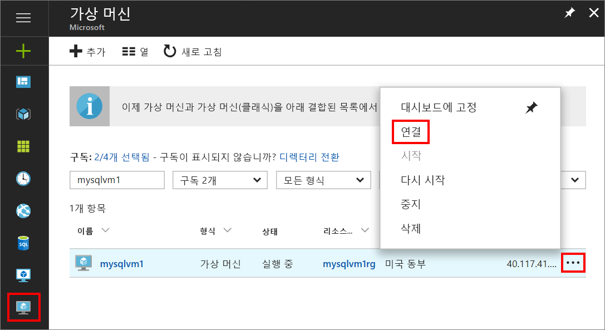
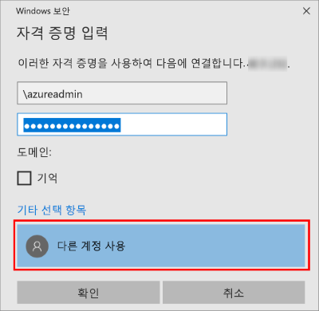

다음 단계를 사용하여 원격 데스크톱으로 SQL Server 가상 컴퓨터에 연결합니다.

1. Azure 가상 컴퓨터를 만들고 실행한 후에 Azure Portal의 Virtual Machines 아이콘을 클릭하면 VM을 볼 수 있습니다.

1. 새 VM에 대한 줄임표(**...**)를 클릭합니다.

1. **Connect**를 클릭합니다.

   

1. 브라우저가 VM에 대해 다운로드한 **RDP** 파일을 엽니다.

1. 원격 데스크톱 연결이 이 원격 연결의 게시자를 식별할 수 없다고 알립니다. **연결**을 클릭하여 계속합니다.

1. **Windows 보안** 대화 상자에서 **다른 계정 사용**을 클릭합니다. **More choices**(옵션 더 보기)를 클릭해야 보일 수도 있습니다. VM을 만들 때 구성한 사용자 이름과 암호를 지정합니다. 사용자 이름 앞에 백슬래시를 추가해야 합니다.

   

SQL Server 가상 컴퓨터에 연결된 후에, SQL Server Management Studio를 시작하고 로컬 관리자 자격 증명을 사용하여 Windows 인증으로 연결할 수 있습니다. SQL Server 인증을 사용하도록 설정한 경우에는, 프로비전 중에 구성해 놓은 SQL 로그인 및 암호를 사용하여 SQL 인증에 연결할 수 있습니다.

컴퓨터에 연결하면 요구 사항에 따라 컴퓨터와 SQL Server 설정을 직접 변경할 수 있습니다. 예를 들어, 방화벽 설정을 구성하거나 SQL Server 구성 설정을 변경할 수 있습니다.