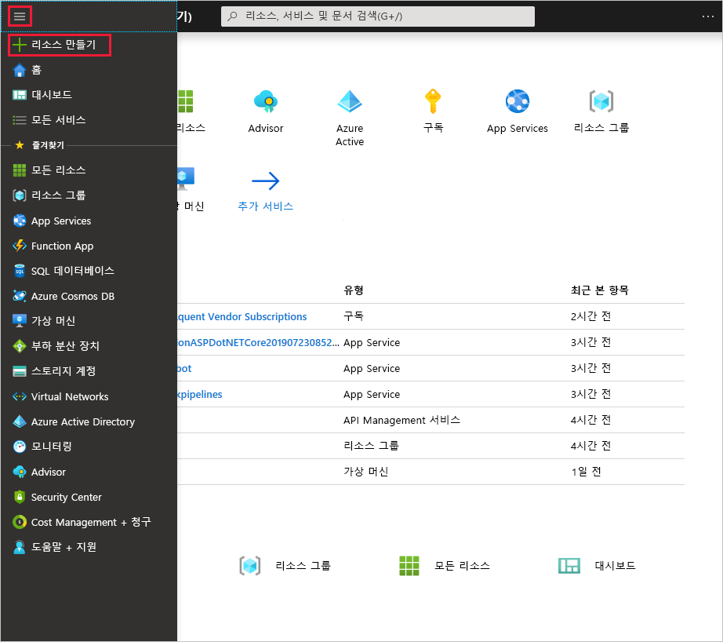

1. [Azure Portal](https://portal.azure.com) 메뉴에서 **리소스 만들기**를 선택 합니다. 

   
2. **Marketplace 검색** 필드에 ' Virtual Network Gateway '를 입력 합니다. 검색 결과에서 **가상 네트워크 게이트웨이**를 찾아서 항목을 클릭합니다. **가상 네트워크 게이트웨이** 페이지에서 **만들기**를 클릭 합니다. 그러면 **가상 네트워크 게이트웨이 만들기** 페이지가 열립니다.

   

   
3. **가상 네트워크 게이트웨이 만들기** 페이지에서 가상 네트워크 게이트웨이의 값을 채웁니다.

   **프로젝트 세부 정보**

   - **구독**: 드롭다운에서 사용 하려는 구독을 선택 합니다.
   - **리소스 그룹**:이 설정은이 페이지에서 가상 네트워크를 선택 하면 자동으로 채워집니다.

   **인스턴스 세부 정보**

   - **이름**: 게이트웨이 이름을 지정합니다. 게이트웨이 이름 지정은 게이트웨이 서브넷의 이름을 지정 하는 것과 동일 하지 않습니다. 만드는 게이트웨이 개체의 이름입니다.
   - **지역**:이 리소스를 만들려는 지역을 선택 합니다. 게이트웨이의 지역은 가상 네트워크와 동일 해야 합니다.
   - **게이트웨이 유형**: **VPN**을 선택합니다. VPN 게이트웨이는 가상 네트워크 게이트웨이 유형 **VPN**을 사용합니다. 
   - **VPN 유형**: 구성에 대해 지정된 VPN 유형을 선택합니다. 대부분의 구성에는 경로 기반 VPN 유형이 필요합니다.
   - **SKU**: 드롭다운에서 게이트웨이 SKU를 선택합니다. 드롭다운에 나열되는 SKU는 선택하는 VPN 유형에 따라 달라집니다. 게이트웨이 SKU에 대한 자세한 내용은 [게이트웨이 SKU](../articles/vpn-gateway/vpn-gateway-about-vpn-gateway-settings.md#gwsku)를 참조하세요.

      **가상 네트워크**: 이 게이트웨이를 추가하려는 가상 네트워크를 선택합니다.

      **게이트웨이 서브넷 주소 범위**:이 필드는 VNet에 게이트웨이 서브넷이 없는 경우에만 표시 됩니다. 가능 하면 범위를/27 이상 (/26,/25 등)으로 설정 합니다. /28 보다 작은 범위는 만들지 않는 것이 좋습니다. 게이트웨이 서브넷이 이미 있는 경우 가상 네트워크로 이동 하 여 게이트웨이 서브넷 세부 정보를 볼 수 있습니다. **서브넷** 을 클릭 하 여 범위를 확인 합니다. 범위를 변경 하려는 경우에는 게이트웨이 서브넷을 삭제 하 고 다시 만들 수 있습니다.

   **공용 IP 주소**: 이 설정은 VPN 게이트웨이에 연결되는 공용 IP 주소 개체를 지정합니다. VPN Gateway가 생성될 때 공용 IP 주소가 이 개체에 동적으로 할당됩니다. 게이트웨이가 삭제되고 다시 만들어지는 경우에만 공용 IP 주소가 변경됩니다. VPN Gateway의 크기 조정, 다시 설정 또는 기타 내부 유지 관리/업그레이드 시에는 변경되지 않습니다.

     - **공용 IP 주소**: **새로 만들기** 를 선택한 상태로 둡니다.
     - **공용 ip 주소 이름**: 텍스트 상자에 공용 ip 주소 인스턴스의 이름을 입력 합니다.
     - **할당**: VPN Gateway는 동적만 지원 합니다.

   **활성-활성 모드**: 활성-활성 게이트웨이 구성을 만드는 경우에만 **활성-활성 모드 사용** 을 선택 합니다. 그렇지 않은 경우 이 설정을 선택하지 않은 상태로 둡니다.

   구성에서 이 설정이 명시적으로 필요한 경우를 제외하고 **BGP ASN 구성**을 선택 취소된 상태로 둡니다. 이 설정이 필요한 경우 기본 ASN은 65515이며 변경 가능합니다.

4. **검토 + 만들기** 를 클릭 하 여 유효성 검사를 실행 합니다. 유효성 검사가 통과 되 면 **만들기** 를 클릭 하 여 VPN gateway를 배포 합니다. 게이트웨이는 전체를 만들고 배포 하는 데 최대 45 분이 걸릴 수 있습니다. 게이트웨이의 개요 페이지에서 배포 상태를 확인할 수 있습니다.

게이트웨이를 만든 후 포털에서 가상 네트워크를 살펴보면 게이트웨이에 할당된 IP 주소를 볼 수 있습니다. 게이트웨이가 연결된 디바이스로 표시됩니다.
