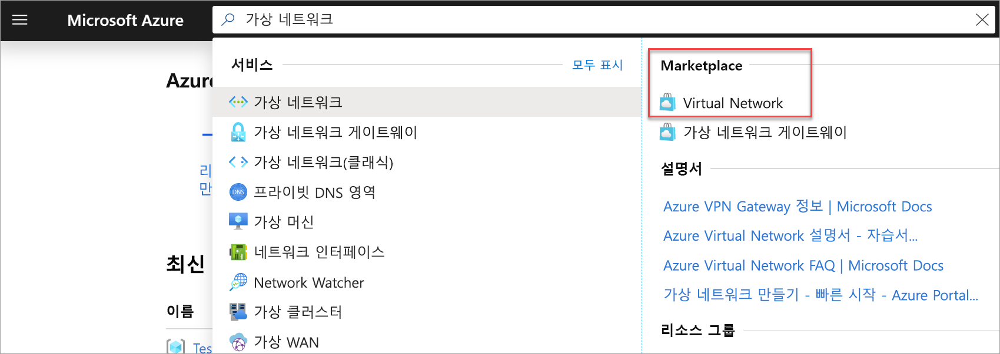
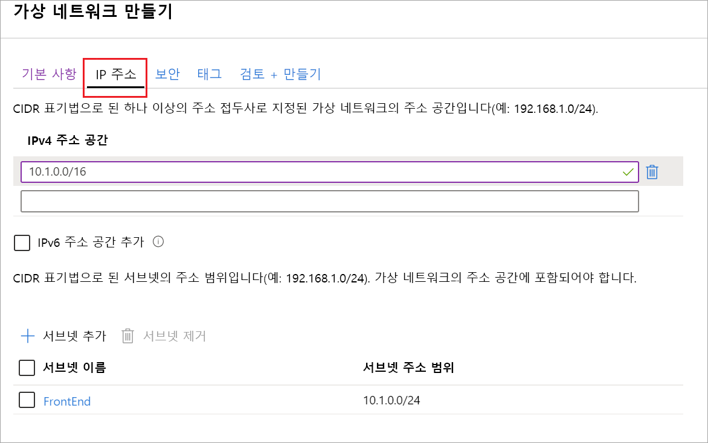

1. [Azure Portal](https://portal.azure.com)에 로그인합니다.
1. **검색 리소스, 서비스 및 문서(G +/)** 에서 *가상 네트워크* 를 입력합니다.

   
1. **Marketplace** 결과에서 **Virtual Network** 를 선택합니다.

   
1. **Virtual Network** 페이지에서 **만들기** 를 선택합니다.

   
1. **만들기** 를 선택하면, **가상 네트워크 만들기** 페이지가 열립니다.
1. **기본** 탭에서 **프로젝트 세부 정보** 및 **인스턴스 세부 정보** VNet 설정을 구성합니다.

    필드를 채울 때 필드에 입력한 문자의 유효성이 검사되면 녹색 확인 표시가 됩니다. 일부 값은 자동으로 채워지며, 사용자 고유의 값으로 바꿀 수 있습니다.

   - **구독** : 나열된 구독이 올바른지 확인합니다. 드롭다운을 사용하여 구독을 변경할 수 있습니다.
   - **리소스 그룹** : 기존 리소스 그룹을 선택하거나 **새로 만들기** 를 클릭하여 새로 만듭니다. 리소스 그룹에 대한 자세한 내용은 [Azure Resource Manager 개요](../articles/azure-resource-manager/management/overview.md#resource-groups)를 참조하세요.
   - **Name** : 가상 네트워크에 대한 이름을 입력합니다.
   - **지역** : VNet에 대한 위치를 선택합니다. 이 위치는 이 VNet에 배포하는 리소스가 상주하는 위치를 결정합니다.

1. **IP 주소** 탭에서 값을 구성합니다. 아래 예제에 표시된 값은 데모용입니다. 필요한 설정에 따라 이 값을 조정합니다.

     
   - **IPv4 주소 공간** : 기본적으로 주소 공간은 자동으로 만들어집니다. 주소 공간을 클릭하여 자신의 값을 반영하도록 조정할 수 있습니다. 또한 주소 공간을 추가할 수도 있습니다.
   - **서브넷** : 기본 주소 공간을 사용하는 경우 기본 서브넷이 자동으로 만들어집니다. 주소 공간을 변경하는 경우 서브넷을 추가해야 합니다. **+ 서브넷 추가** 를 선택하면 **서브넷 추가** 창이 열립니다. 다음 설정을 구성한 다음, **추가** 를 선택하여 값을 추가합니다.
      - **서브넷 이름** : 이 예에서는 서브넷 이름을 "FrontEnd"로 지정했습니다.
      - **서브넷 주소 범위** : 이 서브넷의 주소 범위입니다.

1. **보안** 탭에서 이때는 기본값을 그대로 둡니다.

   - **DDos 보호** : 기본
   - **방화벽** : 사용 안 함
1. **검토 + 만들기** 를 선택하여 가상 네트워크 설정의 유효성을 검사합니다.
1. 설정의 유효성을 검사한 후 **만들기** 를 선택합니다.
